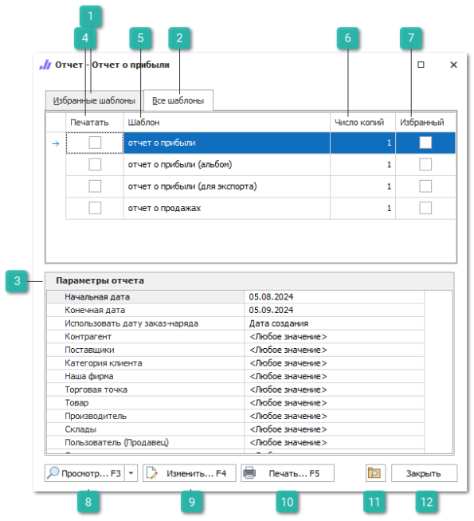
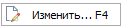
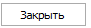

Пункт меню **Отчеты и анализ** содержит группы отчетов, каждая из групп включает в себя перечень отчетов с множеством шаблонов для выбора.

Перед печатью или просмотром отчета необходимо задать его параметры, в зависимости от которых в отчет попадают данные для отображения.

 **Избранные шаблоны**

Вкладка содержит список шаблонов добавленных в избранное.

 **Все шаблоны**

Вкладка содержит перечень всех доступных печатных форм по отчету с возможностью выбора их для печати с нужным количеством копий документа, а также возможность отметить отчет как избранный;

 **Параметры отчета**

Вкладка содержит параметры, в зависимости от которых отбираются данные в отчеты.

::: info Примечание

` `Обязательные параметры отмечены значком – \*.

:::
Для всех отчетов идентичными являются свойства **Начальная/конечная дата**, далее, в зависимости от вида отчета, необходимо заполнять свойственные для него параметры, которые будут действовать на все шаблоны в группе отчетов. Данные в отчет отбираются согласно заданным параметрам.

После выставления параметров отчет доступен для печати и просмотра.

 **Печать**

Колонка позволяет выбрать необходимые для печати документы.

 **Шаблон**

В колонке отображаются наименования документов доступных для печати.

 **Число копий**

Колонка позволяет указать необходимое для печати количество копий документа.

 **Избранный**

Позволяет добавить шаблон в список избранных, которые отображаются на вкладке **Избранные шаблоны**. Что позволяет отметить только используемые на практике бланки и работать с ними.

 **Просмотр (F3)**

Позволяет открыть просмотр документа/отчета перед печатью. В дополнение к просмотру можно в раскрывающемся меню экспортировать выбранный шаблон в соответствующем формате в Word, Excel или PDF.

 **Изменить (F4)**

Позволяет изменить шаблон печати. Откроется редактор шаблонов.

 **Печать (F5)**

Позволяет распечатать выбранные документы.

 **Расположение шаблонов**

Позволяет открыть в проводнике папку с шаблонами.

 **Закрыть**

Позволяет закрыть **Мастер печати шаблонов**.