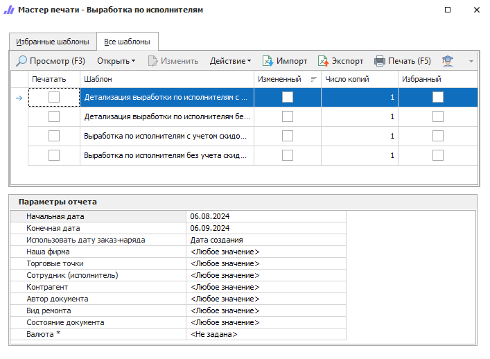

Отчет позволяет проанализировать деятельность автосервиса по исполнителям: общая выработка и детализация по каждому сотруднику с учетом или без учета скидок на выполненные работы. Для выборки документов **Заказ-Наряд** по времени можно указать на какую дату документа опираться: дату создания, начала работ, завершения либо закрытия.

::: details Читайте также

- [Общие принципы формирования отчетов](../obshchie_printsipy_formirovaniya_otchetov.md)

:::