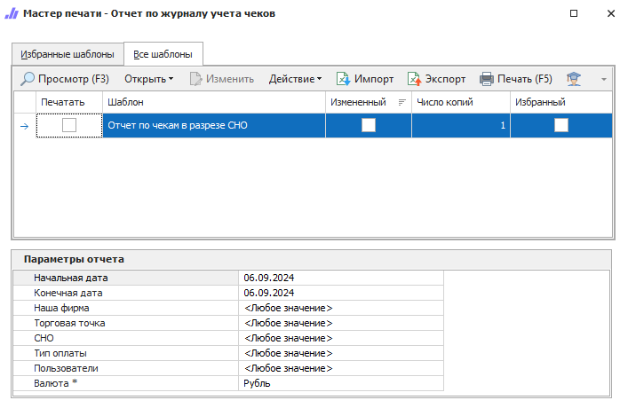

Отчет строится на основании информации из **Журнала учета чеков** и позволяет просматривать информацию о напечатанных чеках в разрезе системы налогообложения.

::: details Читайте также

- [Общие принципы формирования отчетов](../obshchie_printsipy_formirovaniya_otchetov.md)

- [Журнал учета чеков](../../finansy/zhurnal_ucheta_chekov.md)

- [Создание Отчета по журналу учета чеков](../../../work/otchety/po_kasse/po_zhurnalu_ucheta_chekov.md)

:::

