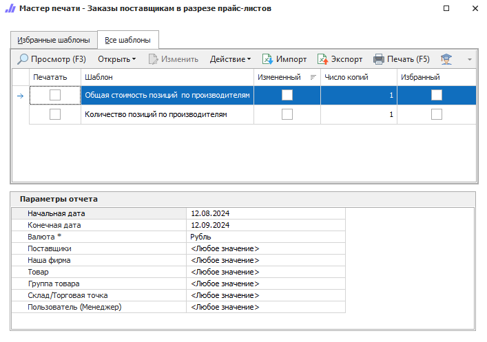

Отчет позволяет получить информацию об общем количестве/стоимости заказанных у поставщика товаров в разрезе его прайс-листов.

Доступны следующие печатные бланки:

- **Количество позиций по производителям**;

- **Общая стоимость позиций по производителям**.

::: details Читайте также

[Общие принципы формирования отчетов](../obshchie_printsipy_formirovaniya_otchetov.md)

[Создание отчета Заказы поставщикам в разрезе прайс-листов](../../../work/otchety/po_postavshchikam/zakazy_postavshchikam_v_razreze_prajs-listov.md)

:::