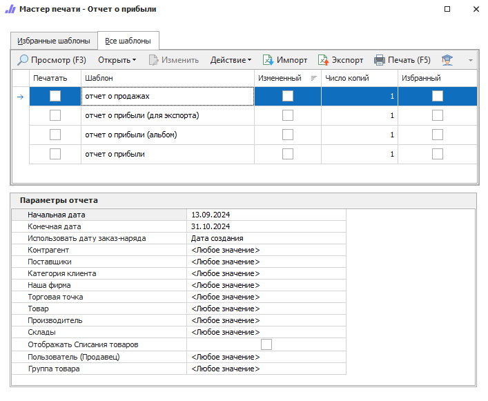

**Отчет о прибыли** содержит данные о проведенных операциях по товарам за выбранный период. Отчет позволяет оценить прибыль компании. В зависимости от выбранных настроек и печатных бланков можно построить множество отчетов о прибыли в разрезе выбранных критериев.

Доступны следующие печатные бланки:

- **Отчет о прибыли**;

- **Отчет о прибыли (альбом)**;

- **Отчет о прибыли (для экспорта)**;

- **Отчет о продажах**.

Для отчета отбираются товарные транзакции в состояниях "*расход*" либо "*заказ-наряд*", затем применяются фильтры из параметров отчета.

::: note Заметка

Если в настройках не задать виды статей расходов для **Нашей фирмы**, то затраты в отчете не будут посчитаны. Задать **Статьи** расходов/доходов можно через меню **Управление ► Настройки программы ► Наши фирмы**. Данную настройку необходимо задать для всех **Наших фирм**, если их несколько.

:::

::: details Читайте также

- [Общие принципы формирования отчетов](../obshchie_printsipy_formirovaniya_otchetov.md)

- [Создание Отчета о прибыли](../../../work/otchety/po_pribyli/otchet_o_pribyli.md)

:::