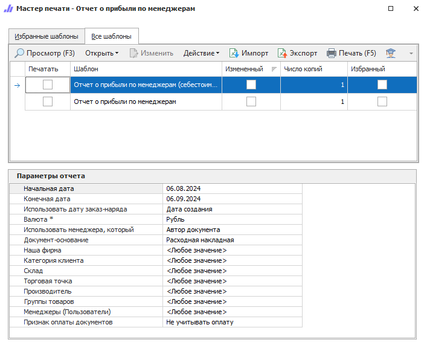

**Отчет о прибыли по менеджерам** содержит данные по заказам всех менеджеров за выбранный период. Показывает информацию о прибыли по каждому менеджеру.

Доступны следующие печатные бланки:

- **Отчет о прибыли по менеджерам**;

- **Отчет о прибыли по менеджерам (себестоимость)**.

::: info Примечание

Среди пользователей (менеджеров), в случае функционирования интернет-магазина на **Parts.Resource**, присутствует пользователь с ролью **Веб-служба**. При выборе в качестве документа-основания **Заказ клиента**, прибыль по заказам из интернет-магазина будет закреплена за данным системным пользователем.

:::

::: details Читайте также

- [Общие принципы формирования отчетов](../obshchie_printsipy_formirovaniya_otchetov.md)

- [Создание Отчета о прибыли по менеджерам](../../../work/otchety/po_pribyli/po_menedzheram.md)

:::