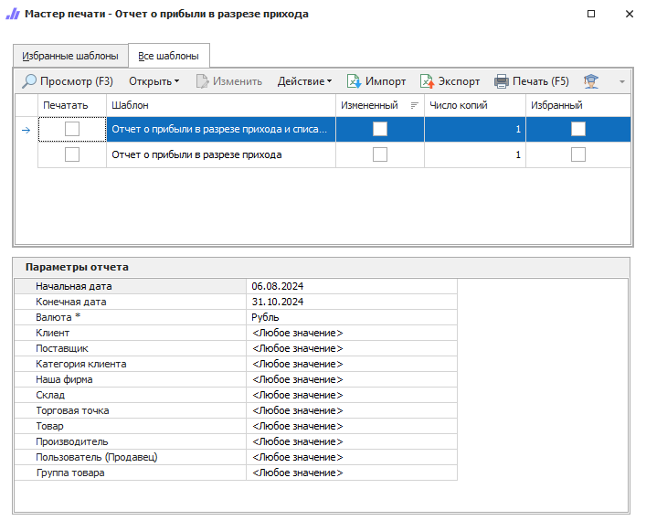

**Отчет о прибыли в разрезе прихода** содержит данные о прибыли по каждому приходу отдельно. Аналогичен отчету о прибыли, но в разрезе прихода.

Доступны следующие печатные бланки:

- **Отчет о прибыли в разрезе прихода**;

- **Отчет о прибыли в разрезе прихода и списаний**.

::: details Читайте также

- [Общие принципы формирования отчетов](../obshchie_printsipy_formirovaniya_otchetov.md)

- [Создание Отчета о прибыли в разрезе прихода](../../../work/otchety/po_pribyli/v_razreze_prikhoda.md)

:::