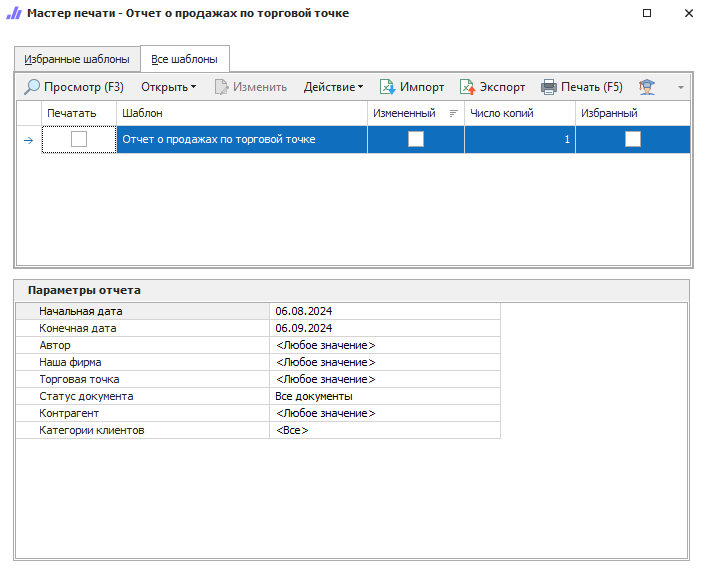

**Отчет о продажах по торговой точке** содержит данные о проведенных операциях, связанных с продажами за указанный период.

::: info Примечание

Документ в отчете является оплаченным, если его долг равен 0 и платежи по этому документу попали в указанный в отчете период времени.

:::

::: details 

- [Общие принципы формирования отчетов](../obshchie_printsipy_formirovaniya_otchetov.md)

- [Создание Отчета о продажах по торговой точке](../../../work/otchety/po_pribyli/o_prodazhakh_po_torgovoj_tochke.md)

:::