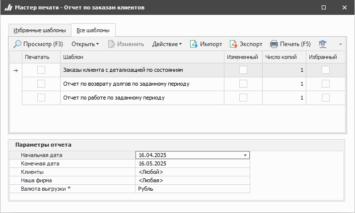

Отчет **Заказы клиентов** отражает погашение долга по заказам за выбранный период. Отчет строится на базе документов **Заказы клиентов**.

Доступны следующие печатные бланки:

- **Заказы клиента с детализацией по состояниям** – содержит подробные данные по заказам клиентов за выбранный период с детализацией состояний позиций;

- **Отчет по возврату долгов по заданному периоду** – содержит данные о наличии и суммах задолженностей клиентов по заказам;

- **Отчет по работе по заданному периоду** – содержит подробные данные по заказам клиентов за выбранный период.

::: details Читайте также

- [Общие принципы формирования отчетов](../obshchie_printsipy_formirovaniya_otchetov.md)

- [Создание отчета Заказы клиентов](../../../work/otchety/po_zakazam_klientov/zakazy/otchet_po_rabote_po_zadannomu_periodu.md)

:::