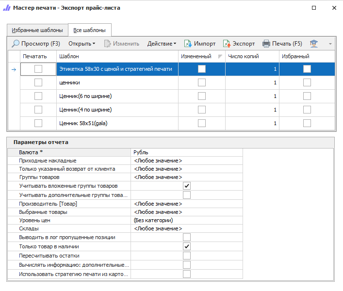

Данный инструмент позволяет выгрузить прайс-лист из системы для товаров в наличии с заданными настройками, либо распечатать ценники заданного формата. Отчет также может быть вызван из справочника **Товары** либо из **Корзины**. Например, после добавления товаров в корзину (из документов **Приходная накладная** и/или из справочника **Товаров**), можно распечатать ценники на выбранные товары.

::: details Читайте также

- [Общие принципы формирования отчетов](../obshchie_printsipy_formirovaniya_otchetov.md)

- [Создание отчета Экспорт прайс-листа](../../../work/otchety/skladskie_otchety/export/eksport_prajs-lista.md)

:::