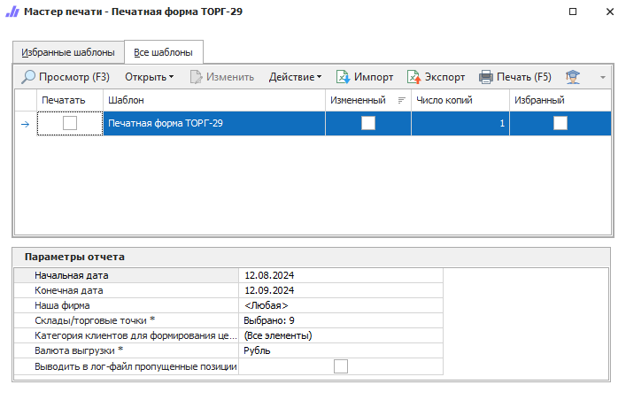

Товарный отчет применяется для учета товарных документов в организациях торговли за отчетный период, который утверждается руководителем организации. Отчет строится за определенный промежуток времени, указывая остатки товара на складе на начало периода в ценах выбранной категории и оборот товара по складу, опять же в ценах выбранной категории.

::: details Читайте также

- [Общие принципы формирования отчетов](../obshchie_printsipy_formirovaniya_otchetov.md)

- [Создание отчета Печатная форма ТОРГ-29](../../../work/otchety/skladskie_otchety/pechatnaya_forma_torg-29.md)

:::