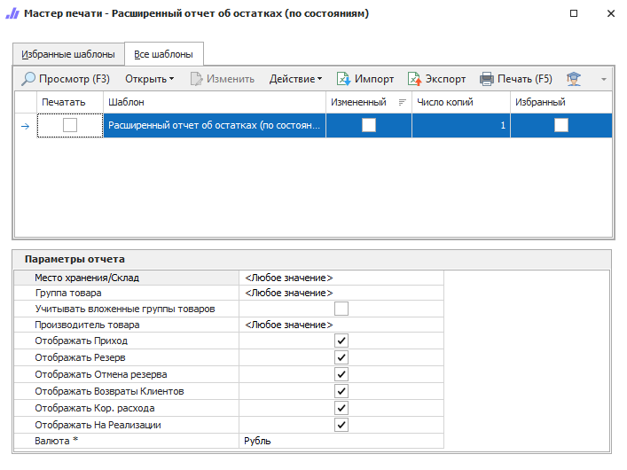

Отчет отражает состояние дел по товару из наличия в зависимости от текущего состояния товара, т.е. где фактически расположен товар, сколько его там и т.д.

::: details Читайте также

- [Общие принципы формирования отчетов](../obshchie_printsipy_formirovaniya_otchetov.md)

- [Создание отчета Расширенный отчет об остатках (по состояниям)](../../../work/otchety/skladskie_otchety/ob_ostatkakh_po_sostoyaniyam.md)

:::