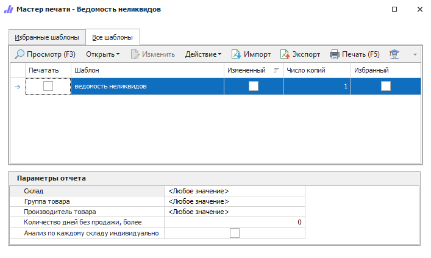

Отчет, позволяющий отобразить товары в наличии, по которым не было продаж более указанного количества дней. В рамках отчета можно оценить состав и количество неликвидов независимо по каждому складу, либо в рамках всех складов.

::: details Читайте также

- [Общие принципы формирования отчетов](../obshchie_printsipy_formirovaniya_otchetov.md)

- [Создание отчета Ведомость неликвидов](../../../work/otchety/skladskie_otchety/vedomost_nelikvidov.md)

:::