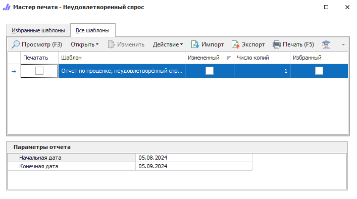

Отчет по товарам, которые имеют статус **Неудовлетворенный спрос**. Этот статус присваивается товарам в **Проценке** в том случае, если на запрос клиента фирма не в состоянии предоставить ему товар. Для присвоения статуса необходимо в окне **Проценки** вызвать контекстное меню на товаре и выбрать команду **Неудовлетворенный спрос**.

::: details Читайте также

- [Общие принципы формирования отчетов](../obshchie_printsipy_formirovaniya_otchetov.md)

- [Формирование отчета статистики Неудовлетворенного спроса](../../../work/otchety/zaprosy_protsenki/neudovletvorennyj_spros.md)

:::