::: warning Внимание!

Вкладка **Контрагенты** доступна, если заполнены данные на вкладках [**Наши фирмы**](./nashi_firmy.md) и [**Торговые точки и склады**](./torgovye_tochki_i_sklady.md).

:::

Вкладка позволяет импортировать клиентов и поставщиков в соответствующие справочники.

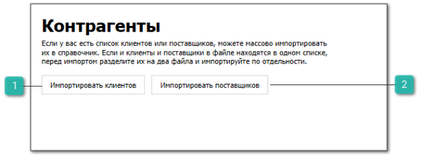

 **Импортировать клиентов**

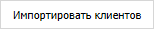

Команда позволяет открыть страницу **Разметка списка клиентов** и импортировать клиентов.

::: warning Внимание!

В импортируемом файле должна присутствовать и быть заполнена колонка **Наименование** клиента.

:::

 **Импортировать поставщиков**

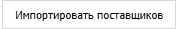

Команда позволяет открыть страницу **Разметка списка поставщиков** и импортировать поставщиков.

::: warning Внимание!

В импортируемом файле должна присутствовать и быть заполнена колонка **Наименование** поставщика.

:::

Страницы **Разметка списка клиентов** / **Разметка списка поставщиков** содержат:

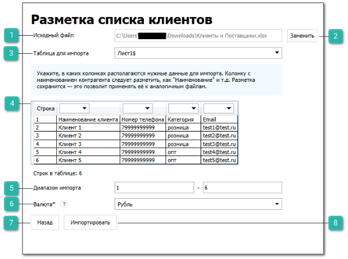

 **Исходный файл**

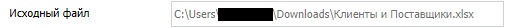

Отображает путь до выбранного импортируемого файла.

 **Заменить**

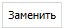

Позволяет заменить импортируемый файл в поле **Исходный файл**.

 **Таблица для импорта**

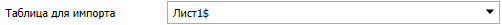

Позволяет выбрать конкретную таблицу из файла для импорта.

 **Табличная часть разметки**

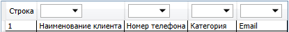

Позволяет разметить файл для импорта

::: warning Внимание!

Для корректного импорта необходимо разметить колонку **Наименование**.

:::

 **Диапазон импорта**

Позволяют установить диапазон импортируемых строк файла.

 **Валюта**

Позволяет выбрать валюту для клиентов/поставщиков

::: note Заметка

Выбранная валюта установится в карточках всех импортируемых клиентов/поставщиков в полях **Национальная валюта** и **Основная валюта**.

:::

 **Назад**

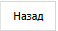

Команда позволяет вернуть на вкладку **Контрагенты**.

 **Импортировать**

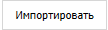

Команда позволяет перейти на страницу **Проверка импорта**, которая содержит:

- табличную часть для проверки правильности размеченных данных;

- **Вернуться к разметке** – позволяет вернуться на страницу **Разметка списка клиентов**/**Разметка списка поставщиков**;

- **Принять** – позволяет завершить импорт контрагентов.

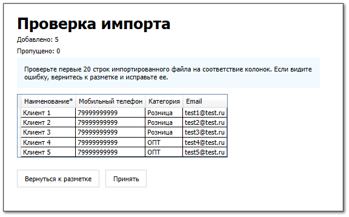

::: info Примечание

При переходе на страницу **Проверка импорта** в справочниках **Клиенты**/**Поставщики** создаются карточки импортируемых контрагентов. При возвращении на страницу **Разметка списка клиентов**/**Разметка списка поставщиков** созданные карточки удаляются.

:::