::: warning Внимание!

Вкладка **Почта** доступна, если заполнены данные на вкладках [**Наши фирмы**](./nashi_firmy.md) и [**Торговые точки и склады**](./torgovye_tochki_i_sklady.md).

:::

Вкладка позволяет заполнить данные данные о почтовом сервисе, чтобы отправлять клиентам уведомления о email.

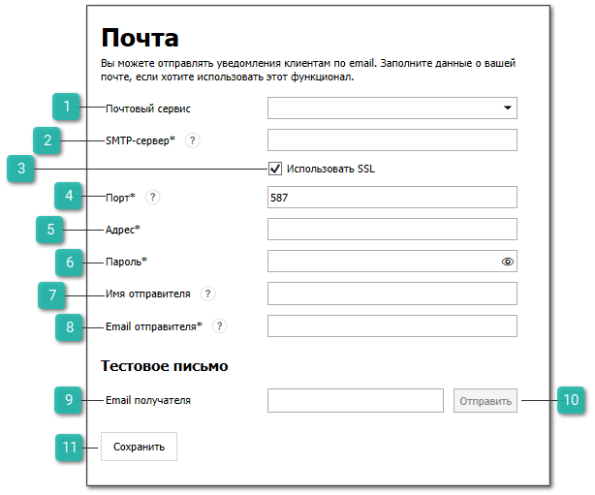

 **Почтовый сервис**

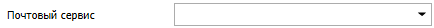

Позволяет выбрать почтовый сервис:

- **Google**;

- **Mail.ru**;

- **Outlook**;

- **Rambler**;

- **Tradesoft**;

- **Yandex**;

- **Другой**.

 **SMTP-сервер**

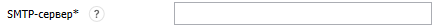

Позволяет заполнить SMTP-сервер почтового сервера. Значение автоматически подставляется при выборе сервиса в поле **Почтовый сервис**, кроме значения **Другой**.

 **Использовать SSL**

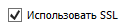

Позволяет выбрать, использовать ли защищенное соединение SSL при отправке сообщений по Email.

 **Порт**

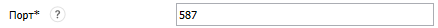

Позволяет задать порт SMTP-сервера почтового сервиса. Значение автоматически подставляется при выборе сервиса в поле **Почтовый сервис**, кроме значения **Другой**.

 **Адрес**

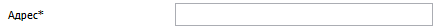

Позволяет задать Email-адрес, с которого произойдет авторизация почтового сервиса и будут отправляться письма клиентам.

 **Пароль**

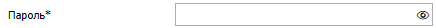

Позволяет задать пароль приложений от почты, с которой будут отправляться письма клиентам. При нажатии на поле доступно [руководство пользователя](https://product-doc.tradesoft.ru/email/index.htm) по созданию паролей приложений.

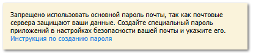

 **Имя отправителя**

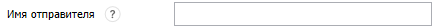

Позволяет задать имя отправителя, которое клиенты увидят в поле "От кого".

 **Email отправителя**

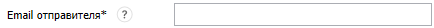

Позволяет задать Email отправителя, который клиенты увидят в поле "От кого"

 **Email получателя**

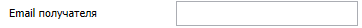

Позволяет задать Email получателя для отправки тестового письма.

 **Отправить**

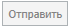

Позволяет отправить тестовое письмо. 

 **Сохранить**

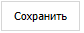

Позволяет сохранить внесенные изменения.

::: note Заметка

При нажатии команды **Сохранить** в разделе:

- **Управление ► Настройки программы**, вкладка **Настройки**, группа настроек **CRM ► Уведомления ► Электронная почта** заполнятся поля настроек;

- **Управление ► Справочники ► Учетные записи email** добавится запись почтового сервиса с заполненными настройками.

:::