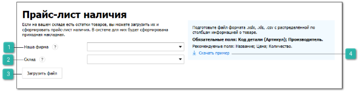
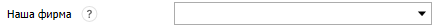
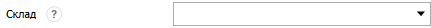
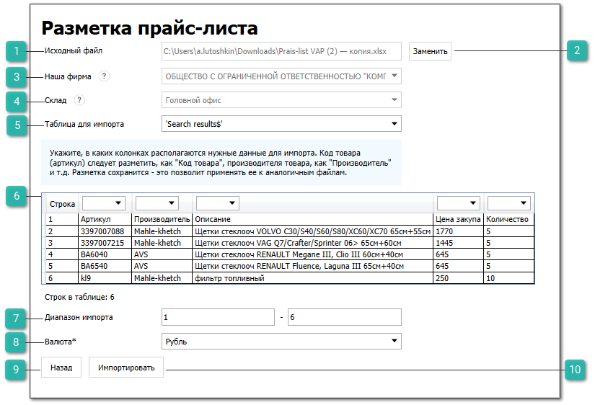
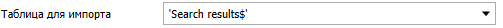
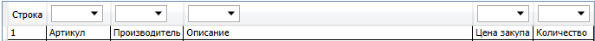
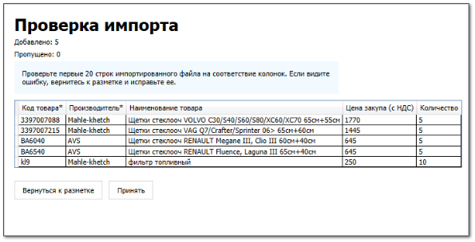

::: warning Внимание!

Вкладка **Прайс-лист наличия** доступна, если заполнены данные на вкладках [**Наши фирмы**](./nashi_firmy.md) и [**Торговые точки и склады**](./torgovye_tochki_i_sklady.md).

:::

Вкладка позволяет импортировать прайс-лист наличия в программу.

::: info Примечание

Во время импорта создается и проводится документ **Приходная накладная**.

:::

 **Наша фирма**

Позволяет выбрать **Нашу фирму** прайс-листа. Выбранная **Наша фирма** указывается в документе **Приходная накладная**, поле **Наша фирма**.

 **Склад**

Позволяет выбрать склад для товаров прайс-листа наличия. Выбранный склад указывается в документе **Приходная накладная**, поле **Склад**.

 **Загрузить файл**

Позволяет выбрать файл для импорта и открыть страницу **Разметка прайс-листа**. 

::: warning Внимание!

В импортируемом файле должны присутствовать и быть заполнены колонки **Код детали (Артикул)** и **Производитель** позиций.

:::

 **Скачать пример**

Позволяет скачать пример прайс-листа наличия.

Страница **Разметка прайс-листа наличия** содержит:

 **Исходный файл**

Отображает путь до выбранного импортируемого файла.

 **Заменить**

Позволяет заменить импортируемый файл в поле **Исходный файл**.

 **Наша фирма**

Отображает **Нашу фирму**, выбранную на вкладке **Прайс-лист наличия**.

 **Склад**

Отображает склад, выбранный на вкладке **Прайс-лист наличия**.

 **Таблица для импорта**

Позволяет выбрать конкретную таблицу из файла для импорта.

 **Табличная часть разметки**

Позволяет разметить файл для импорта.

::: warning Внимание!

Для корректного импорта необходимо разметить колонки **Код товара** и **Производитель**.

:::

 **Диапазон импорта**

Позволяют установить диапазон импортируемых строк файла.

 **Валюта**

Позволяет выбрать валюту цен в файле.

::: info Примечание

Выбранная валюта установится в разделе **Прайс-лист наличия**, колонке **Валюта**.

:::

 **Назад**

Позволяет вернуться на вкладку **Прайс-лист наличия**.

 **Импортировать**

Позволяет автоматически создать документ **Приходная накладная** с товарами из файла и перейти на страницу **Проверка импорта**, которая содержит:

- табличную часть для проверки правильности размеченных данных;

- **Вернуться к разметке** – позволяет вернуться на страницу **Разметка прайс-листа**;

- **Принять** – позволяет провести созданный документ **Приходная накладная** и завершить импорт прайс-листа наличия.

