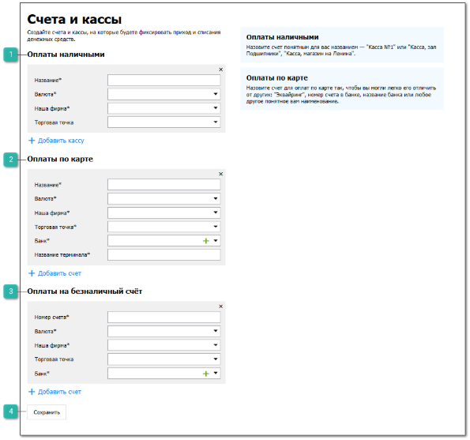
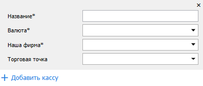
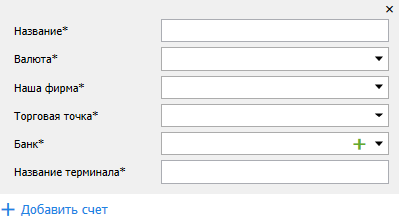
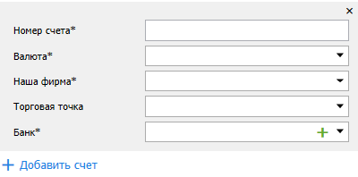
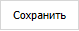

::: warning Внимание!

Вкладка **Счета и кассы** доступна, если заполнены данные на вкладках [**Наши фирмы**](./nashi_firmy.md) и [**Торговые точки и склады**](./torgovye_tochki_i_sklady.md).

:::

Вкладка позволяет задать счета и кассы для оплаты наличными, по карте и для безналичного расчета.

 **Оплата наличными**

Блок содержит:

- **Название** – позволяет задать название кассы, на которую принимается оплата наличными;

- **Валюта** – позволяет задать валюту, с которой работает касса;

- **Наша фирма** – позволяет задать **Нашу фирму**, которой принадлежит касса;

- **Торговая точка** – позволяет задать торговую точку, на которой располагается касса;

- **Добавить кассу** – позволяет добавить дополнительную кассу.

 **Оплата по карте**

Блок содержит:

- **Название** – позволяет задать название счета, на который поступают платежи по банковской карте через терминал;

- **Валюта** – позволяет выбрать валюту счета;

- **Наша фирма** – позволяет выбрать **Нашу фирму** (организацию), которой принадлежит терминал;

- **Торговая точка** – позволяет выбрать торговую точку, где располагается терминал;

- **Банк** – позволяет выбрать или создать карточку банка, в котором открыт счет;

- **Название терминала** – позволяет задать название терминала для принятия оплаты по карте;

- **Добавить счет** – позволяет добавить дополнительный счет.

 **Оплата на безналичный счёт**

Блок содержит:

- **Номер счета** – позволяет указать номер расчетного счета для принятия денежных переводов;

- **Валюта** – позволяет указать валюту счета;

- **Наша фирма** – позволяет указать **Нашу фирму** (организацию), которой принадлежит счет;

- **Торговая точка** – позволяет указать торговую точку, которая использует счет;

- **Банк** – позволяет выбрать или создать карточку банка, в котором оформлен расчетный счет;

- **Добавить счет** – позволяет добавить дополнительный счет.

 **Сохранить**

Команда позволяет сохранить внесенные изменения и создать счета и кассы, а также правила для счетов **Нашей фирмы** по умолчанию.

::: note Заметка

При создании счетов в разделе **Финансы ► Счета и кассы** добавятся записи счетов.

При создании счетов в блоках **Оплаты наличными** и **Оплаты на безналичный счёт** в разделе **Финансы ► Счета и кассы ► Настроить счета НФ по умолчанию** сформируются по 2 правила **Тип платежа** – значение **ПП** / **ППвх** и **ПКО** / **РКО**.

При создании счета в блоке **Оплаты по картам** в разделе **Управление ► Торговое оборудование ► Справочник торгового оборудования**, вкладке **Эквайринг** добавится запись **Тип устройства** – **Не интегрированный**.

:::