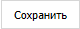

::: warning Внимание!

Вкладка **Торговые точки** доступна, если создана хотя бы одна запись на вкладке [**Наши фирмы**](./nashi_firmy.md). 

:::

Вкладка позволяет создать торговые точки и склады.

 **Торговые точки**

Блок содержит:

- **Название** – позволяет задать название торговой точки;

- **Добавить торговую точку** – позволяет добавить дополнительную торговую точку.

 **Склады**

Блок содержит:

- **Название** – позволяет задать название склада;

- **Добавить склад** – позволяет добавить дополнительный склад.

 **Сохранить**

Команда позволяет сохранить внесенные изменения и добавить торговые точки/склады в справочник **Склады/Торговые точки**.

::: note Заметка

При нажатии команды **Сохранить** в разделе **Склад и закупки ► Склады/Торговые точки** добавятся торговая точка и склад.

:::