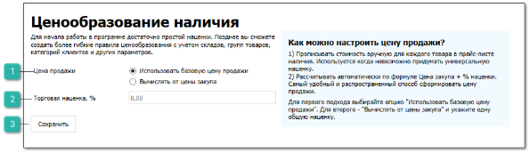
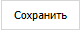

::: warning Внимание!

Вкладка **Ценообразование наличия** доступна, если заполнены данные на вкладках [**Наши фирмы**](./nashi_firmy.md) и [**Торговые точки и склады**](./torgovye_tochki_i_sklady.md).

:::

Вкладка позволяет настроить первичное ценообразование для прайс-листа наличия.

 **Цена продажи**

Опция позволяет выбрать режим установки цены:

- **Использовать базовую цену продажи** – позволяет установить базовую цену продажи из прайс-листа наличия как цену продажи;

- **Вычислять от цены закупа** – позволяет вычислять цену продажи относительно цены закупа.

 **Торговая наценка, %**

Позволяет установить процент наценки относительно цены закупа. Опция доступна, если в опции **Цена продажи** выбрано значение **Вычислять от цены закупа**.

 **Сохранить**

Позволяет сохранить внесенные изменения и создать правило ценообразования для прайс-листа наличия.

::: note Заметка

При нажатии команды **Сохранить** в разделе **Товары и цены ► Прайс-лист наличия**, на вкладке **Ценообразование** добавится запись маркетинга.

:::