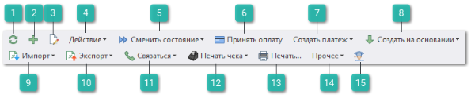
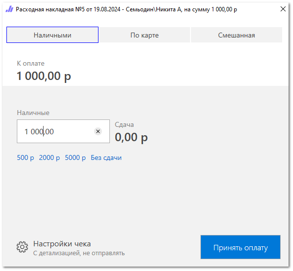
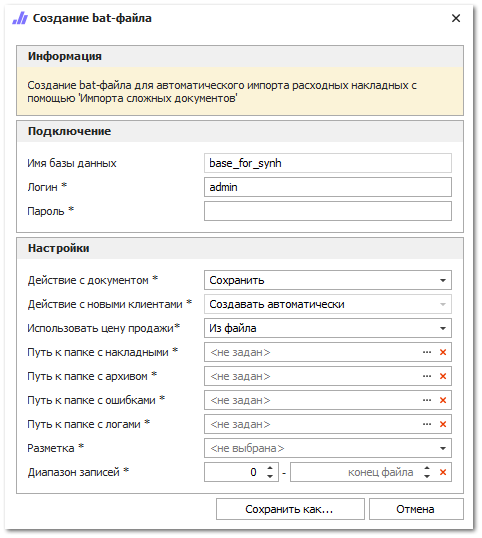
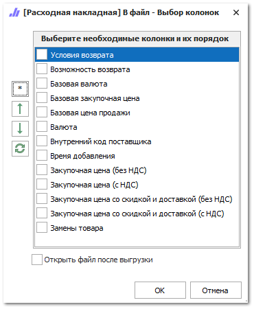
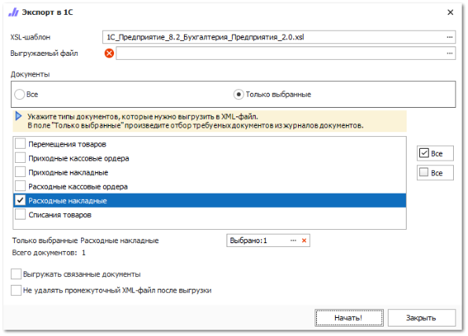
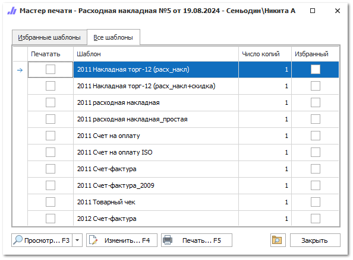
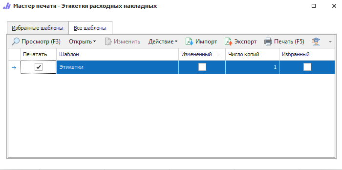

На панели инструментов доступны следующие действия:

 **Обновить**

Позволяет обновить список документов. Рекомендуется использоваться после внесения массовых изменений.

 **Новый**

Позволяет открыть окно [инспектора](./inspektor_dobavlenija_novoj_rashodnoj_nakladnoj.md) для добавления нового документа **Расходная накладная**.

 **Править**

Позволяет открыть окно инспектора для редактирования документа.

 **Действие**

Содержит выпадающий список команд:

- **Удалить** – удаляет выделенную запись.

- **Изменить отметку** – позволяет указать **Отметку** для выделенной записи** из справочника **Отметки** **в документах** раздела **Управление ► Справочники**;

- **Снять отметку** – снимает **Отметку** у выделенной записи;

 **Сменить состояние**

Позволяет провести документ, отменить его проведение, а так же произвести действия с архивированием документа.

 **Принять оплату**

Позволяет запустить интерфейс оплаты по выбранному документу для автоматического создания связанных платежных документов и печати чека. Кнопка доступна только для проведенных документов, имеющих задолженность.

 **Создать платеж**

Позволяет выбрать из выпадающего списка команду для создания платежей:

- **Приходный кассовый ордер**;

- **Платежное поручение входящее**;

- **Оплата по банковской карте**.

 **Создать на основании**

Позволяет сформировать следующие документы на основании выделенного:

- **Задание на отгрузку товара** – формирует документы **Задание на отгрузку товара** с распределением позиции товара по их складам в отдельные документы, либо формирует документ по всем позициям с незаполненным полем **Склад**;

- **Возврат от клиента** – формирует документ **Возврат от клиента** с позициями документа;** 

- **Корректировка расходной накладной** – формирует документ **Корректировка расходной накладной** с позициями документа;** 

- **Расходная накладная** **(копия)** – формирует копию документа **Расходная накладная**;

- **Расходная накладная (Мастер)** – открывает окно **Мастер создания расходной накладной** с фильтрацией по **Клиент** или **Поставщик** указанных в документе;

- **Приходная накладная** – формирует документ **Приходная накладная** с позициями документа.

::: note Замечание

Для формирования документа **Приходная накладная** в документе должны содержаться позиции с состояниями **Заказ поставщику** или **Возврат поставщику**.

:::

 **Импорт**

Позволяет произвести импорт документа с помощью команд:

- **В новый документ** – при импорте создается новый документ **Расходная накладная**;

- **В выделенный документ** – данные файла импортируются в выделенный документ **Расходная накладная**;

- **Сложные документы** – при импорте создаются новые документы **Расходная накладная**, данные файла группируются по полю разметки **Контрагент**;

- **Создать bat-файл** – позволяет создать bat-файла для **Автоматического импорта Расходных накладных**. Для автоматического импорта необходимо предварительно создать разметку **Импорта сложных документов**, а после создать bat-файл и задать настройки импорта.

::: note Замечание

Импорт доступен для документов в формате:Файла MS Access (\*.mdb);
Microsoft Excel 95-2003 (\*.xls);
Microsoft Excel 2007-2013 (\*.xlsx, \*.xlsm);
Файлы dBase (\*.dbf);
Текстовые файлы с разделителями "точка с запятой", "запятая", "табуляция" (\*.txt, \*.csv).

:::

Форма создания bat-файла содержит:

- **Имя БД, Логин и Пароль** – позволяет ввести данные для входа в БД. Учетная запись, от лица которой выполняется импорт;

- **Действие с документом** – позволяет выбрать действия с новыми документами: Сохранять или Сохранять и проводить;

- **Действие с новыми клиентами** – позволяет выбрать действия с новыми клиентами – Создавать автоматически;

- **Использовать цену продажи** – позволяет выбрать цену продажи: Из файла или Из связанных Заказов клиентов;

- **Путь к папке с накладными** – позволяет указать путь к папке, в которую попадают файлы РН (одна папка для накладных от всех клиентов);

- **Путь к папке с архивом** – позволяет указать путь к папке, в которую попадают успешно импортируемые файлы с накладными;

- **Путь к папке с ошибками** – позволяет указать путь к папке, куда попадают файлы с накладными, которые не были импортированы в программу;

- **Путь к папке с логами** – позволяет указать путь к папке, куда попадают файлы с описанием шагов импорта по каждому документу;

- **Разметка** – позволяет указать разметку из **Импорт сложных документов**;

- **Диапазон записей** – позволяет указать интервал строк в файле для загрузки.

::: note Замечание

Созданный bat-файл при запуске сканирует папку с накладными. Если найдены файлы импортируемых форматов, то программа начинает импорт и создание РН в программе. В случае успешного импорта, файл помещается в папку с архивом, иначе – в папку с ошибками. При этом в любом случае создается лог-файл с описанием этапов импорта.

:::

 **Экспорт**

Содержит выпадающий список с командами:

- **В файл** – позволяет открыть окно для выделения колонок для экспорта;

- **Выгрузка в 1С** – позволяет открыть окно экспорта в 1С;

- **Экспорт для vat.gov.by** – позволяет выгрузить XML-документ, содержащий информацию о **Счете-фактуре**.

::: info Примечание

Этот вид экспорта актуален только пользователей из Республики Беларусь.

:::

 **Связаться**

Содержит выпадающий список команд:

- **Позвонить** – позволяет осуществить звонок на номер телефона контрагента;

::: info Примечание

Команда доступна для пользователей с подключенной IP-телефонией. Для подключения телефонии свяжитесь с менеджерами компании Tradesoft.

:::

- **Открыть чат** – позволяет открыть чат на основе Telegram-бота с выбранным клиентом, если клиент подписан на Telegram-бота;

::: info Примечание

Для работы сервиса отправки уведомлений и сообщений через Telegram-бота необходимо:подключение дополнительной услуги. За подключением услуги обратитесь в отдел продаж Компании Tradesoft;
созданный и настроенный Telegram-бот;
установленный и подключенный Сервер Parts.Intellect. Подробнее в разделе [Установка Сервера Parts.Intellect](#678abee0-5d3e-466d-8a1b-d556b23a5110).
Подробнее о работе модуля читайте в [руководстве пользователя](https://product-doc.tradesoft.ru/ai/telegram/index.htm).

:::

- **Отправить документы** –** позволяет сформировать и отправить бланки документов по накладной на электронную почту клиента. Настройка параметров отправки осуществляется в разделе меню **Управление ► Настройки программы ► Настройки ►** группа **CRM** **► Уведомления ► Электронная почта**.

 **Печать чека**

Содержит выпадающий список команд для печати чеков:

- **Итого по документу** –** позволяет напечатать итоговый чек по документу;

- **С детализацией** –** позволяет напечатать детализированный чек с позициями по документу.

 **Печать**

Позволяет открыть окно **Мастер печати**, в котором содержатся шаблоны документов, доступных для печати.

 **Прочее**

Содержит выпадающий список с командами:

- **Добавить в корзину** – добавляет в корзину пользователя все позиции товаров из документа;

- **Мастер заказов** – позволяет открыть **Мастер заказа на склад** и осуществить формирование заказа с его использованием;

- **Навигация по связям** – позволяет просмотреть список всех связанных документов, а так же последовательность их создания;

- **Обновить данные по документу** – по нажатию на команду выполняется обновление данных по документу;

- **Печать этикеток** – позволяет открыть окно **Мастер печати**, в котором содержатся шаблоны этикеток, доступных для печати.

 **Помощь**

Позволяет открыть руководство пользователя по разделу.