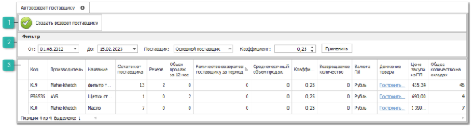
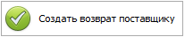
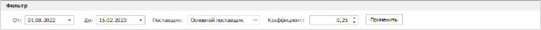

Инструмент **Автовозврат поставщику** предназначен для автоматического формирования документов **Возвраты поставщикам** по товарам, которые не продавались или имели низкие продажи в заданный промежуток времени.

 **Создать возврат поставщику**

По нажатию на команду будет автоматически сформирован документ **Возврат поставщику** со всеми позициями, отмеченными для возврата.

 **Фильтр**

Позволяет отфильтровать товары с помощью фильтров:

- **От и До** – указывается промежуток времени для отображения позиций. В результаты попадут только те товары, которые были оприходованы в указанный период;

- **Поставщик** – поставщик, доставивший товары;

- **Коэффициент** –  коэффициент продаж товара. В результатах будут выведены товары с заданным коэффициентом продаж.

- **Применить** – позволяет применить фильтры.

Кнопка **Применить** позволяет применить заданные параметры фильтра.

 **Табличная часть**

**Табличная часть** содержит данные о товарах, которые не продавались или имели низкие продажи в заданный промежуток времени, претендующие на возврат поставщику.

::: note Замечание

Список, порядок и отображение колонок в **Табличной части** настраивается индивидуально каждым пользователем программы. Для отображения/скрытия колонок используется команда **Выбор колонок**, которая открывает одноименное окно.

:::

Доступные колонки по позициям в инструменте **Автовозврат поставщику**:

- **Валюта ПЛ** – валюта прайс-листа поставщика;

- **Возвращаемое количество** – количество товара, которое будет возвращено поставщику. Указывается вручную после применения фильтрации;

- **Движение товара** – поле содержит ссылку **Построить отчет**, которая позволяет сформировать отчет **Движение и наличие товара**;

- **Код** – артикул детали;

- **Количество возвратов поставщику за период** – количество товара, возвращенного поставщику за указанный период;

- **Коэффициент** – коэффициент продаж товара**;**

- **Название** – наименование товара;

- **Общее количество на складах** – общее количество товара в наличии на всех складах, доступных пользователю;

- **Объем продаж за 12 мес** – количество проданного товара за период 12 месяцев;

- **Остаток от поставщика** – количество товара от конкретного поставщика в наличии всех складах**;**

- **Производитель** – наименование производителя товара;

- **Резерв** – количество товара, зарезервированного под покупателей;

- **Среднемесячный объем продаж** – среднее количество товара, продаваемого каждый месяц;

- **Цена закупа из ПЛ** – закупочная цена из прайс-листа поставщика.