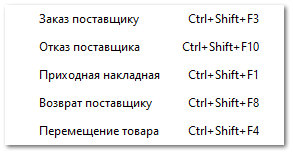

Данный подраздел содержит список мастеров для быстрого формирования документов:

- **Заказ поставщику**;

- **Отказ поставщика**;

- **Приходная накладная**;

- **Возврат поставщику**;

- **Перемещение товара**.

::: note Замечание

Для создания документов в программе **Parts.Intellect** представлены:

- **Мастер создания Приходной накладной**;

- **Мастер создания Расходной накладной**;

- **Мастер создания Заказа поставщику**;

- **Мастер создания Возврата клиента**;

- **Мастер создания Возврата поставщику**;

- **Мастер создания Перемещения**;

- **Мастер создания Отказа клиента**;

- **Мастер создания Отказа поставщика**;

- **Мастер создания Резервирования**;

- **Мастер создания Возврата с реализации**.

:::