Мастер позволяет быстро сформировать документ **Приходная накладная** на товары, требующие оприходования.

::: info Примечание

**Мастер создания Приходной накладной** осуществляет поиск и подсчитывает количество товара только из документов**,** на основании которых может быть создана **Приходная накладная.**В колонке **Остаток** будет выведено количество только того товара, состояние которого соответствует значению в столбце **Состояние**.

:::

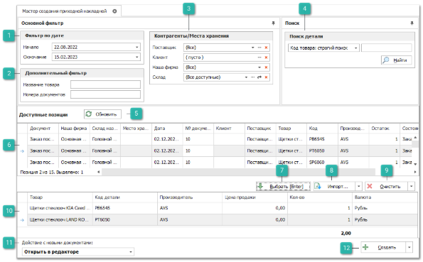

 **Фильтр по дате**

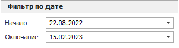

**Фильтр по дате** позволят указать временной промежуток за который необходимо отобразить документы для поиска.

 **Дополнительный фильтр**

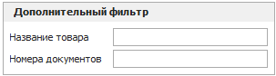

**Дополнительный фильтр** позволят указать названия товаров либо номера документов через точку с запятой (;). Если известна лишь часть названия товара либо номера документа, то допускается поиск по части слова. После ввода нажать кнопку **Обновить** в блоке **Доступные позиции**.

 **Контрагенты/Места хранения**

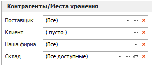

Фильтр **Контрагенты/Места хранения** позволят указать по кому будет осуществлена фильтрация документов с товарами: по **Поставщику** или **Клиенту**. Так же указывается, где будет осуществлен поиск: **Наша фирма**, **Склад**.

::: note Замечание

Выбор складов осуществляется из списка складов, доступных для работы текущему пользователю программы.

:::

 **Поиск детали**

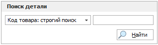

Блок позволяет указать свойство товара по которому необходимо осуществить поиск и  осуществить поиск детали.

Доступные для выбора свойства:

- **Код товара: строгий поиск** – производится строгий поиск доступных позиций по указанному коду товара;

- **Код товара: по вхождению** – производится поиск доступных позиций по указанной части кода товара;

- **Штрихкод производителя** – производится поиск доступных позиций по указанной части штрихкода производителя товара;

- **Референс от клиента** – производится поиск доступных позиций по референсу товара от клиента;

- **СШ позиции ЗК** – производится поиск доступных позиций по указанному системному штрихкоду товара из заказа клиента;

- **Референс от поставщика** – производится поиск доступных позиций по референсу товара от поставщика;

- **СШ позиции ЗП** – производится поиск доступных позиций по указанному системному штрихкоду товара из заказа поставщику.

::: note Замечание

Детали, которые участвуют в поиске, автоматически попадают в **Выбранные позиции**. Это сделано на случай, когда пользователь системы считывает сканером код товара для занесения в выбранные позиции.

:::

 **Обновить**

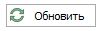

Позволяет обновить список доступных позиций до актуального состояния.

 **Доступные позиции**

Позиции доступные для создания документа.

::: note Замечание

Список, порядок и отображение колонок в **Табличной части** настраивается индивидуально каждым пользователем программы. Для отображения/скрытия колонок используется команда **Выбор колонок**, которая открывает одноименное окно.

:::

Доступные колонки по позициям в блоке **Доступные позиции**:

- **№ ГТД** – номер грузовой таможенной декларации, если деталь была импортирована в страну;

- **№ документа** – номер документа;

- **Автор** – автор документа;

- **В наличии на доступных складах** – общее наличие по товару на всех складах, доступных пользователю для работы;

- **Валюта** – валюта цен в документе;

- **Внутренний код – Внутренний код** из карточки товара;

- **Внутренний код поставщика – Внутренний код** товара из прайс-листа поставщика;

- **Возможность возврата** – отображает признак возможности возврата товара из прайс-листа;

- **Город клиента** – город клиента указанный в карточке контрагента;** 

- **Группа товара** – основная группа товара из карточки;

- **Дата** – дата и время создания документа;

- **Документ** – наименование, дата и номер документа с позицией доступной для создания приходной накладной;

- **Дополнительные свойства товара** – дополнительные свойства товара из карточки;

- **Закупочная цена со скидкой и доставкой (с НДС)** – цена закупа с учетом процента скидки/наценки по документу и НДС;

- **Идентификатор места хранения** – идентификатор **Место хранения** указанный в карточке **Склады/Торговые точки** раздела **Склад и закупки**;

- **Клиент – Клиент** указанный в документе;

- **Код** – артикул детали;

- **Код контрагента** – код клиента из справочника **Контрагенты**;

- **Маркетинг** – информация о **Маркетинге**, который применился к позиции при добавлении из **Проценки** или **Корзины**;

- **Место хранения** – склад/торговая точка/место хранения где находится позиция;

- **Мобильный телефон – Мобильный телефон** указанный в карточке контрагента;

- **Направление/Склад** – направление поставки или склад из прайс-листа;

- **Наша фирма** – наша фирма на которую оформлен документ;

- **Общее наличие на складах** – общее наличие товара на всех складах, в том числе недоступных пользователю;

- **Остаток** – текущий остаток на складе в указанном состоянии;

- **Ответственный менеджер** – ответственный менеджер клиента из справочника **Контрагенты**;

- **Отметка** – отметка документа из справочника **Отметки в документах**;

- **Плановая дата доставки** – отображает дату доставки детали;

- **Подсостояние** – подсостояние позиции документа;

- **Поставщик** – поставщик** из справочника **Контрагенты**;

- **Поставщик из маркетинга** – поставщик из **Маркетинг** (если к позиции применен маркетинг);

- **Примечания** – примечание к позиции;

- **Производитель – Производитель** указанный в карточке товара;

- **Рабочий телефон – Рабочий телефон** клиента из карточки контрагента;

- **Референс от клиента** – содержит информацию по товару от клиента;

- **Референс от поставщика** – содержит информацию по товару от поставщика;

::: note Замечание

В полях **Референс от клиента** и **Референс от поставщика** содержится информация от клиента или поставщика для идентификации позиции, например,** информацию по которой понимает по какому прайс-листу поставщика/договору оформляется заказ.

:::

- **Склад назначения/место выдачи** – торговая точка/склад, с которого предполагается выдавать товар клиенту;

- **Состояние** – состояние позиций документа;

- **Страна – Страна** товара из справочника **Страны** раздела **Управление ► Словари и классификаторы**;

- **Сумма долга** – сумма задолженности по документу;

- **СШ позиции ЗК** – системный штрихкод позиции по документу **Заказ клиента**;

- **СШ позиции ЗП** – системный штрихкод позиции по документу **Заказ поставщику**;

- **Тип документа** – тип документа на основании которого выделены доступные позиции;

- **Товар** – наименование детали (из источника позиции);

- **Цена продажи со скидкой и доставкой (с НДС)** – цена продажи, если она присутствовала в **Источник позиции** или была введена вручную, с учетом процента скидки/наценки по документу, значения колонки **Стоимости доставки** (если включен ее учет).

::: note Замечание

Помимо штатных фильтров, расположенных на панели **Основной фильтр**, присутствует возможность фильтрации позиций с помощью **Конструктора фильтров**. Данный инструмент значительно расширяет возможности мастеров. **Конструктор фильтров** вызывается с помощью одноименной команды контекстного меню при клике на колонку табличной части.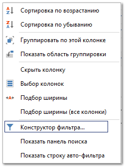

:::

Из мастера возможно осуществить редактирование данных в колонках:

- **Документ**;

- **Наша фирма**;

- **Клиент**;

- **Поставщик**;

- **Товар**;

- **Поставщик из маркетинга**.

Редактирование осуществляется путем нажатия на галочку в необходимой ячейке, после чего откроется соответствующая форма для редактирования.

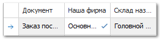

 **Выбрать**

Позволяет добавить выбранные позиции из блока **Доступные позиции** в блок **Выбранные позиции**.

 **Импорт...**

Позволяет отобразить позиции мастера **Из файла** или документа **Задание на разбор товара**. 

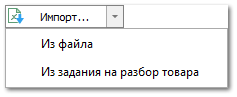

Программа сверит товары из файла/задания и список позиций из блока **Доступные позиции**:

- Если товар есть в файле/задании и в позициях мастера, то он добавится в выбранные позиции, следуя правилам:

    - Если количество искомого товара из файла/задания совпадает с количеством в позициях этого же товара в мастере, то товар попадает в список выбранных. Причем, если в мастере найдено несколько позиций с требуемым количеством, то отбирается позиция с максимально близкой ценой к цене из файла/задания;

    - Если позиции в мастере с совпадающим количеством отсутствуют, то товар из файла/задания равномерно "расходует" количество у доступных позиций мастера.

::: note Замечание

В **Мастере создания Приходной накладной** позиции из наиболее ранних **Заказов клиента** являются приоритетными.

:::

- Если товар присутствует в файле/задании, но отсутствует в позициях мастера, то такие позиции будут отфильтрованы и выведены в файл-журнал процесса.

::: info Примечание

Если включена опция **Использовать Оригинальные замены в МПН** (меню **Управление ► Настройки программы ► Настройки**, группа **Склад и закупки ► Закупки**), то подбор товара в мастере осуществляется с учетом следующей логики:

- если товар из файла/задания не был найден в списке ожидаемых позиций мастера, то программа для этого товара через справочник **Оригинальных замен** ищет устаревшие артикулы;

- затем программа ищет среди ожидаемых позиций мастера товар с устаревшим артикулом;

- затем устаревшим артикулом по отношению к устаревшему и так далее;

Таким образом, программа, используя справочник **Оригинальных замен производителей**, пытается определить, что пришла замена по товару. 

:::
::: note Замечание

Дополнительной возможностью при импорте из файла является выбор в разметке колонок **Код контрагента** и **Номер Заказа поставщику**, по которым программа автоматически понимает, для какого клиента и из какого **Заказа поставщику** пришел товар.

Так же доступна возможность подбора позиций с помощью разметки одного из четырех референсов:

- **референс от клиента;**

- **СШ позиции ЗК;**

- **референс от поставщика;**

- **СШ позиции ЗП.**

:::

 **Очистить**

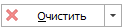

Позволяет отчистить список от одной или нескольких выбранных позиций. Также доступна полная очистка списка по кнопке **Очистить всё**.

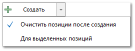

 **Выбранные позиции**

Позиции которые выбраны для создания документа. 

::: note Замечание

Детали, которые участвуют в поиске, автоматически попадают в **Выбранные позиции**. Это сделано на случай, когда пользователь системы считывает сканером код товара для занесения в выбранные позиции.

Список, порядок и отображение колонок в **Табличной части** настраивается индивидуально каждым пользователем программы. Для отображения/скрытия колонок используется команда **Выбор колонок**, которая открывает одноименное окно.

:::

Доступные колонки по позициям в табличной части **Выбранные позиции**:

- **№ ГТД** – номер грузовой таможенной декларации, если деталь была импортирована в страну;

- **№ счета-фактуры** – номер счета-фактуры указанный в документе;

- **Валюта** – валюта цен в документе;

- **Внутренний код поставщика – Внутренний код** товара из прайс-листа поставщика;

- **Возможность возврата** – отображает признак возможности возврата товара из прайс-листа;

- **Дата счета-фактуры** – дата и время создания счета-фактуры;

- **Документ проведен** – указывает признак проведенности документа;

- **Закупочная цена** – цена закупа детали у поставщика;

- **Замена. Код детали** – артикул детали замены;

- **Клиент – Клиент** указанный в документе;

- **Код детали** – артикул детали;

- **Код ТНВЭД от поставщика** – код ТНВЭД из прайс-листа поставщика;

- **Кол-во** – количество товара;

- **Маркетинг** – информация о **Маркетинге**, который применился к позиции при добавлении из **Проценки** или **Корзины**;

- **Место хранения** – склад/торговая точка/место хранения где находится позиция;

- **Наименование товара от поставщика** – название товара из прайс-листа поставщика;

- **Наша фирма** – наша фирма на которую оформлен документ;

- **Плановая дата доставки** – отображает дату доставки детали;

- **Поставщик** – поставщик** из справочника **Контрагенты**;

- **Примечания** – примечание к позиции;

- **Производитель – Производитель** указанный в карточке товара;

- **Состояние** – состояние позиций документа;

- **Ставка НДС** – значение ставки в процентах;

- **Старый склад/Место хранения** – старый склад/место хранения позиции товара;

- **Статус** – статус товара;

- **Стоимость (вкл НДС)** – стоимость товара с учетом процента скидки/наценки по документу (если выделяется НДС);

- **Страна – Страна** товара из справочника **Страны** раздела **Управление ► Словари и классификаторы**;

- **Сумма НДС** – сумма НДС по позиции с учетом процента скидки/наценки;

- **Товар** – наименование детали (из источника позиции);

- **Цена продажи** – цена продажи товара с учетом процента скидки/наценки по документу (если выделяется НДС);

- **Цена продажи без НДС** – цена продажи товара без учета НДС.

Для каждого столбца доступны несложные расчеты. Для этого нажать правой клавишей мыши на панели под столбцом и выбрать требуемый алгоритм: **Сумма**, **Минимум**, **Максимум**, **Количество**, **Среднее**, **Нет**.

![ref54]

После выбора алгоритма доступен выбор **Режима** расчета:

- **Все строки** – значение будет рассчитываться по всем строкам;

- **Выбранные** – значение будет рассчитываться по выбранным строкам;

- **Смешанный** – значение может быть рассчитано по выбранным строкам, если выбрано больше одной строки или по всем, если выбрано только одна строка или не выбрано ни одной.

 **Действие с новыми документами**

Позволяет выбрать действие, которое будет выполнено над сформированным документом:

- **Открыть в редакторе** – выбранные товары и другие атрибуты будут переданы на форму редактирования документа;

- **Сохранить** – будет создан и сохранен соответствующий документ;

- **Сохранить** **и провести** – будет создан, сохранен и проведен соответствующий документ;

- **Сохранить, провести и напечатать** – будет создан, сохранен, проведен и отправлен на печать соответствующий документ;

- **Сохранить, провести и отправить по почте** – будет создан, сохранен, проведен и отправлен по почте соответствующий документ.

::: note Замечание

При выполнении действия **Сохранить, провести и отправить по почте** после создания документа на почту будет отправлен файл с позициями документа. Перед отправкой необходимо указать колонки, которые будут экспортированы.

:::

 **Создать**

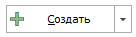

Позволяет сформировать новые документы **Приходная накладная** или **Задание на разбор товара**. 

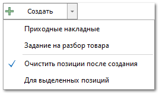

Также доступны действия:

- **Очистить позиции после создания** – позволяет очистить **Выбранные позиции** от товаров после создания документа;

- **Для выделенных позиций** – позволяет создать новый документ только для выделенных пользователем позиций.