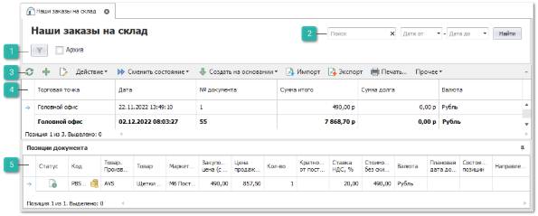
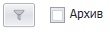
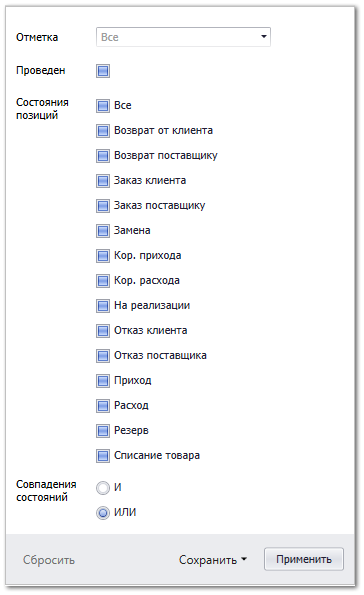
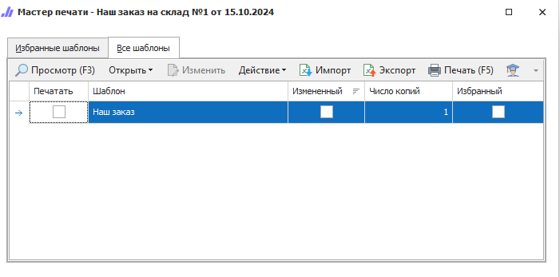

Пункт меню содержит список документов **Наши заказы** **на склад**. Данный тип документа создается для формирования заказов на пополнение свободных остатков на складе. Документ оформляется от лица **Нашей фирмы**.

Как правило, документ создается через специальный **Мастер заказов на склад**, но возможно создание документа вручную через импорт или через импорт с проценкой (по аналогии с **Импортом с проценкой** заказов клиентов, только без выбора клиента).

 **Шаблоны фильтров**

Содержит наборы фильтров созданных пользователями. 

Параметр **Архив** отображает/скрывает записи находящиеся в архиве.

Команда  отображает модальное окно с фильтрами по параметрам:

- **Отметка** – фильтрация записей по **Отметкам** документа;

- **Проведен** – фильтрация записей по признаку проведенности документа;

- **Состояния позиций** - фильтрация по конкретным состояниям позиций документа;

- **Совпадения состояний** – позволяет отфильтровать записи по совпадению нескольких состояний одновременно (**ИЛИ**) или при совпадении только указанных (**И**).

Так же окно содержит команды:

- **Сбросить** – сбрасывать фильтрацию по установленным значениям;

- **Сохранить**:

   - **В новый шаблон** – сохраняет установленные значения фильтра в новый шаблон;

   - **В текущий** – сохраняет установленные значения фильтра в текущий шаблон.

 **Фильтр-поиск**

Позволяет произвести фильтрацию документов с помощью полей:

- **Поиск** – фильтрация производится по найденному значению во всех колонках табличной части;

- **Дата от** и **Дата до** – фильтрация по колонке **Дата** от даты начала и до даты окончания.

Кнопка **Найти** позволяет применить заданные параметры фильтра.

 **Панель инструментов**

**Панель инструментов** позволяет осуществить над выбранными документами типа **Наши заказы на склад** ряд действий:

-  – позволяет обновить содержание табличной части. Рекомендуется использовать после внесения массовых изменений;

-  – позволяет открыть окно создания нового документа **Наш заказ на склад**;

-  – позволяет открыть окно редактирования выбранного документа;

- **Действие** – содержит выпадающий список команд:

   - **Удалить** – позволяет удалить выбранные не проведенные документы; 

   - **Изменить отметку** – позволяет добавить или изменить отметку документа**.** Выбирается из справочника **Отметки в документах** (меню **Управление ► Справочники**);

   - **Снять отметку** – позволяет снять отметку документа.

- **Сменить состояние** – содержит выпадающий список команд для изменения состояний документов:

   - **Провести** – позволяет провести документ;

   - **Отменить** – позволяет отменить проведение документа;

   - **Добавить в Архив** – позволяет добавить документ в **Архив**;

   - **Извлечь из Архива** – позволяет извлечь документ из **Архива**.

- **Создать на основании** –  содержит выпадающий список команд для формирования новых документов на основании отказа:

   - **Наш отказ**;

   - **Заказ поставщику**.

- **Импорт** – команда позволяет загрузить в таблицу (справочник, документы) новые записи из документа:

   - **В новый документ**;

   - **С проценкой** – загружает наши заказы на склад из файла с автоматической проценкой позиций по заданным критериям.

::: note Замечание

Системой поддерживаются следующие форматы файлов для загрузки:

- Microsoft Excel 95-2003 (\*.xls);

- Microsoft Excel 2007-2013 (\*.xlsx, \*.xlsm);

- Файлы dBase (\*.dbf);

- Текстовые файлы с разделителями "точка с запятой", "запятая", "табуляция" (\*.txt, \*.csv).

:::

- **Экспорт** – команда позволяет экспортировать данные из таблицы в файл.

::: note Замечание

Системой поддерживаются следующие форматы выгружаемых файлов:

- Файлы \*.csv с разделителями "точка с запятой", "табуляция";

- Microsoft Excel 2007 (\*.xlsx);

- Таблица XML 2003 (\*.xml);

- MS Access (\*.mdb).

:::

- **Печать** – позволяет открыть окно **Мастер печати** и сформировать печатные бланки** для заказов поставщикам;

- **Прочее** – содержит выпадающий список команд:

   - **Навигация по связям** – позволяет отобразить/скрыть панель **Связи документов**.

-  **Помощь** – позволяет открыть **Руководство пользователя** по разделу.

 **Табличная часть**

**Табличная часть** содержит данные о заказах поставщикам**.**

::: note Замечание

Список, порядок и отображение колонок в **Табличной части** настраивается индивидуально каждым пользователем программы. Для отображения/скрытия колонок используется команда **Выбор колонок**, которая открывает одноименное окно.

:::

Доступные колонки по позициям в справочнике **Наши заказы на склад**:

- **№ документа** – порядковый номер документа;

- **Oid** – уникальный номер позиции документа в базе данных. Присваивается после проведения** документа;

- **Автор** – пользователь, создавший документ;

- **Архив** – статус нахождения документа в архиве;

- **Валюта** – валюта документа;

- **Дата** – дата и время формирования документа**;**

- **Комментарий** – информация для внутреннего пользования, заполняемая в документе;

- **Наша фирма** – наша фирма, от лица которой будет осуществляться заказ поставщику;

- **Отметка** – отметка для документа из справочника **Отметки в документах**;

- **Проведен** – статус проведения документа;

- **Системный штрихкод** – внутренний код, который присваивается при создании документа;

- **Состояние позиций** – состояние (и подсостояние)** позиции;

- **Сотрудник. Подразделение** – подразделение сотрудника, который является автором документа;

- **Сумма долга** – долг по документу, который выступает в качестве платежа;

- **Сумма итого** – сумма документа, который выступает в качестве платежа;

- **Торговая точка** **–** это активная торговая точка пользователя;

- **Торговая точка - автор** – это активная торговая точка пользователя, который является автором документа для выбранной позиции.

 **Позиции документа**

**Позиции документа** содержит данные о позициях в заказах**.**

::: note Замечание

Список, порядок и отображение колонок в **Табличной части** настраивается индивидуально каждым пользователем программы. Для отображения/скрытия колонок используется команда **Выбор колонок**, которая открывает одноименное окно.

:::

Доступные колонки по позициям в **Позиции документа:**

- **Базовая валюта** – валюта, в которой были указаны цены, на момент добавления позиции в документ;

- **Базовая закупочная цена** – цена закупа из "источника" добавления на момент добавления позиции в документ (обычно цена от поставщика);

- **Базовая цена продажи** – цена продажи из "источника" позиции на момент добавления позиции в документ;

- **В наличии на доступных складах** – общее наличие по товару на всех складах, доступных пользователю для работы;

- **В резерве на доступных складах** – общее количество зарезервированного товара на всех складах, доступных пользователю для работы;

- **Валюта** – валюта, в которой указаны цены на позицию;

- **Веб-Инфо** – колонка содержит команду вызова окна, содержащего общую информацию и изображения детали из сервиса **Веб-Инфо**.

::: info Примечание

По вопросу подключения сервиса **Веб-Инфо** можно уточнить информацию в отделе продаж Tradesoft.

:::

- **Внутренний код** – внутренний код товара из карточки товара;

- **Внутренний код поставщика** – внутренний код товара из прайс-листа поставщика;

- **Группа товара** – основная группа товара из карточки;

- **Дополнительные свойства товара** – дополнительные свойства товара из карточки;

- **Единица измерения** – указывает **Единица измерения** из карточки товара;

- **Закупочная цена (без НДС)** – цена закупа детали у поставщика;

- **Закупочная цена (с НДС)** – цена закупа детали у поставщика с учетом значения колонки **Ставка НДС, %**;

- **Закупочная цена со скидкой и доставкой (без НДС)** – цена закупа с учетом **Скидки/Наценки, %** по документу и значения колонки **Стоимости доставки** (если включен ее учет);

::: note Замечание

При расчете значений колонок **Закупочная цена со скидкой и доставкой (без НДС) / (с НДС)** всегда учитывается значение поля **Скидка/Наценка, %**.

Если в параметре документа **Стоимость доставки** выставлено значение **Включать стоимость с учетом скидки** и по позиции есть стоимость доставки, то **Скидка/Наценка, %** применится еще раз.

:::

- **Закупочная цена со скидкой и доставкой (с НДС)** –  цена закупа с учетом **Скидки/Наценки, %** по документу, значения колонок **Стоимости доставки** (если включен ее учет) и **Ставка НДС, %** (если выделяется НДС);

- **Замены товара** – поле заполняется информацией об исходном замененном коде товара в документе;

- **Итоговая стоимость (без НДС)** – стоимость товара с учетом **Скидки/Наценки, %** по документу и значения колонки **Стоимости доставки** (если включен ее учет);

- **Итоговая стоимость (с НДС)** – стоимость товара с учетом **Скидки/Наценки, %** по документу, значения колонок **Стоимости доставки** (если включен ее учет) и **Ставка НДС,** % (если выделяется НДС);

- **Категория клиента из маркетинга** – категория клиента из **Маркетинга** (если к позиции применен маркетинг);

- **Код** – артикул детали. В поле доступна кнопка , при нажатии на которую открывается окно **Проценки** по данному коду;

- **Кол-во** – количество товара по документу;

- **Количество по доставке** – количество товаров, партий и т.п. для расчета **Стоимости доставки**;** 

- **Кратность от поставщика** – коэффициент, согласно которому может быть выбрано количество для заказа от поставщика. Также выполняет роль минимального количества к заказу;

- **Маркетинг** – информация о **Маркетинге**, который применился к позиции при добавлении из **Проценки** или **Корзины**;

- **Меньше минимальной партии от поставщика** – указывает признак если **Кол-во** товара меньше, чем **Минимальная партия от поставщика**;

- **Минимальная партия от поставщика** – минимальное количество единиц товара под заказ в одной партии;

::: note Замечание

Чтобы настроить разрешение на проведение документа с количеством меньше минимальной партии, в разделе **Управление ► Настройки программы**, вкладка **Роли пользователей ► Разрешения для роли пользователей,** группы настроек **Заказы клиентов, Наши заказы на склад, Заказы поставщикам, VIN-запросы** воспользуйтесь настройкой **Можно проводить с количеством меньше минимальной партии поставщика** для нужных документов и пользователей.

:::

- **Направление/Склад** – направление поставки или склад из прайс-листа;

- **Наценка, %** – наценка на товары в отношении закупочной цены к цене продажи по документу;

- **Не соответствует кратности от поставщика** – отметка о несоответствии кратности поставщика;

- **Плановая дата доставки** – ориентировочная дата доставки заказа с учетом системной даты документа, срока доставки и выходных дней;

- **Примечания** – примечание к позиции;

- **Приоритет цен с НДС** – отметка о приоритетности цены с НДС над ценой без НДС;

- **Системный штрихкод** – штрихкод позиции документа, присваиваемый системой;

- **Состояние позиции** – состояние (и подсостояние) позиции;

- **Ставка НДС, %** – ставка НДС в процентах из карточки товара;

::: note Замечание

Изменить значение **Ставки НДС, %** на позиции в документе можно с помощью команды **Изменить ставку НДС** на панели инструментов блока **Товары**.

:::

- **Статус** – статус позиции документа (не равен значению в колонке **Состояние**);

- **Стоимость без скидки (с НДС)** – закупочная цена на товар с НДС с учетом количества;

- **Стоимость доставки** – сумма по доставке товара, рассчитывается по формуле: **Цена доставки** \* **Количество по доставке**;

- **Сумма НДС** – сумма НДС по позиции с учетом скидки поля **Скидка/Наценка, %**;

- **Товар** – наименование детали (из источника позиции);

- **Товар. Альтернативное название** – альтернативное название из карточки товара;

- **Товар. Производитель** – производитель детали (из источника позиции);

- **Товар. Стандартная наценка** – значение наценки из карточки товара;

- **Цена доставки** – значение из справочника **Стоимости доставок**;

- **Цена закупа в прайс-листе из наличия**** – значение **Цена закупа** в **Прайс-листе из наличия** (только для **Расширенной** схемы ценообразования);

- **Цена продажи (без НДС)** – цена продажи, если она присутствовала в "источнике" позиции или была введена вручную;

- **Цена продажи (с НДС)** – цена продажи, если она присутствовала в "источнике" позиции или была введена вручную, с учетом значения колонки **Ставка НДС,** % (если выделяется НДС);

- **Цена продажи со скидкой и доставкой (без НДС)** – цена продажи, если она присутствовала в «источнике» позиции или была введена вручную, с учетом **Скидки/Наценки, %** по документу, значения колонок **Стоимости доставки** (если включен ее учет) и **Ставка НДС, %** (если выделяется НДС);

- **Цена продажи со скидкой и доставкой (с НДС)** – цена продажи, если она присутствовала в «источнике» позиции или была введена вручную, с учетом **Скидки/Наценки, %** по документу, значения колонки **Стоимости доставки** (если включен ее учет);

- **Штрихкод внутренний** – внутренний штрихкод из карточки товара.