Данный пункт позволяет открыть инспектор для создания документа **Приходная накладная**, который используется для оприходования товаров в программе. Позиции в **Приходной накладной** в первую очередь связываются с "заказными" позициями из документов **Заказы поставщикам**. При этом, приоритет выше у тех позиций, которые были заказаны поставщику на основании **Заказа клиента**, либо **Нашего заказа**.

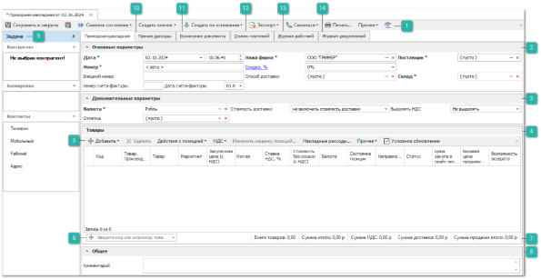

 **Панель инструментов**

- **Панель инструментов**  позволяет осуществить над выбранными позициями документов типа **Приходная накладная** ряд [действий](#370df7fa-a8cb-49ea-a363-e5760b2f112f):

- **Сохранить и закрыть**  – позволяет сохранить и закрыть документ **Приходная накладная** без проводки;

- **Сохранить**  – позволяет сохранить документ **Приходная накладная** без проводки;

- **Сменить состояние**  – содержит выпадающий список команд для изменения состояний документов:

   - **Провести**  – позволяет провести документ;

   - **Отменить**  – позволяет отменить проведение документа;

   - **Добавить в Архив**  – позволяет добавить документ в **Архив**;

   - **Извлечь из Архива**  – позволяет извлечь документ из **Архива**;

- **Создать платеж**  – содержит выпадающий список команд для создания платежей на основании документа: 

   - **Расходный кассовый ордер** ;

   - **Платежное поручение** .

- **Создать на основании**  –  содержит выпадающий список команд для формирования новых документов на основании заказа:

   - **Задание на разбор товара** ;

   - **Отказ клиента** ;

   - **Возврат поставщику** ;

   - **Перемещение** ;

   - **Перемещение товаров по торговым точкам** ;

   - **Перемещение на места хранения по умолчанию** ;

   - **Перемещение по местам комплектации клиентов** ;

   - **Корректировка приходной накладной** ;

   - **Списание товаров** ;

   - **Приходная накладная (копия)** ;

   - **Расходная накладная** ;

   - **Приходная накладная (мастер)** .

- **Экспорт**  – команда позволяет экспортировать данные из таблицы в файл и отправить экспортируемые данные по почте.

::: note Замечание

Системой поддерживаются следующие форматы выгружаемых файлов:

- Файлы \*.csv с разделителями "точка с запятой", "табуляция".

- Microsoft Excel 2007 (\*.xlsx);

- Таблица XML 2003 (\*.xml);

- MS Access (\*.mdb).

:::

- **Связаться**  –  содержит выпадающий список команд для связи с поставщиком:

   - **Позвонить**  – позволяет** осуществить телефонный вызов поставщику**;**

   ::: info Примечание

   Осуществление вызовов доступно только для пользователей с подключенным модулем **IP-телефония**.

   :::

   - **Открыть чат**  – позволяет открыть окно **Чата** с поставщиком;

   ::: info Примечание

   Для работы сервиса отправки уведомлений и сообщений через Telegram-бота необходимо:

   - подключение дополнительной услуги. За подключением услуги обратитесь в отдел продаж Компании Tradesoft;

   - созданный и настроенный Telegram-бот;

   - установленный и подключенный Сервер Parts.Intellect. Подробнее в разделе [Установка Сервера Parts.Intellect](#678abee0-5d3e-466d-8a1b-d556b23a5110).

   Подробнее о работе модуля читайте в [руководстве пользователя](https://product-doc.tradesoft.ru/ai/telegram/index.htm).

   :::

   - **Уведомить клиента**  – позволяет отправить клиенту уведомление по **Проводка Приходной накладной**.

- **Печать**  – позволяет открыть окно **Мастер печати**, в котором содержатся шаблоны документов, доступных для печати;

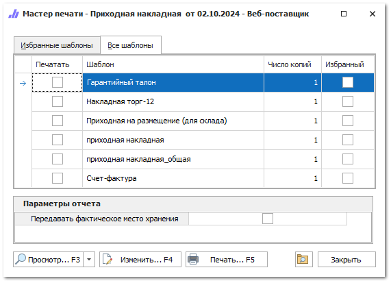

- **Прочее**  – содержит выпадающий список команд:

   - **Навигация по связям**  – позволяет отобразить/скрыть панель **Связи документов**;

   - **Печать этикеток**  – позволяет вывести на печать этикетки по выбранным позициям. 

-  **Помощь** – позволяет открыть **Руководство пользователя** по разделу.

 **Основные параметры**

Блок содержит поля для задания параметров:

- **Дата**  – дата и время создания документа;

::: note Замечание

Для определения даты и времени программа использует данные компьютера пользователя или время компьютера, где расположена база данных, при активной настройке **Использовать локальное время сервера БД** в разделе меню **Управление ► Настройки программы ► Настройки** блок **Системные настройки**.

Возможность ручного редактирования **Даты** документа для пользователя определяется опцей **Можно редактировать дату и время документа** в разделе меню **Управление ► Настройки программы ► Роли пользователей** ► **Разрешения для роли пользователей** ► **Документы ► Приходные накладные**.

:::

- **Номер** – порядковый номер документа задается как автоматически так и вручную. Формат и текущий счетчик для формирования номера документа определяется правилом в разделе меню **Управление ► Справочники ► Счетчик номеров документов**;

::: note Замечание

Возможность ручного редактирования **Номера** документа для пользователя определяется опциями **Можно редактировать номер документа** в разделе меню **Управление ► Настройки программы ► Роли пользователей** ► **Разрешения для роли пользователей** ► **Документы ► Приходные накладные**.

:::

- **Внешний номер** – внешний номер документа;

::: note Замечание

Для пользователя может быть разрешено изменения поля **Внешний номер** даже после проводки документа. Разрешение регулируется опцией **Можно изменять внешний номер документа после  проводки** в разделе меню **Управление ► Настройки программы ► Роли пользователей ► Разрешения для роли пользователей ► Документы ► Приходные накладные**.

:::

- **Номер счета-фактуры**  и **Дата счета-фактуры** – номер и дата документа счет-фактура, по которому пришел товар. Данные значения используются в печатных шаблонах;

- **Наша фирма**  – текущее значение из поля **Фирма** на панели главного меню;

- **Скидка/Наценка, %**  – значение процента скидки или наценки (значение меняется при нажатии на имя поля), которое применяется на все позиции документа. 

::: note Замечание

Значение можно указывать в процентах в поле **Скидка (расчетная), %** или непосредственно в сумме в поле **Сумма скидки**.

Доступ к полю определяется разрешением пользователя **Можно изменять скидку/наценку** в разделе меню **Управление ► Настройки программы ► Роли пользователей ► Разрешения для роли пользователей ► Документы ► Приходные накладные**.

:::

- **Способ доставки**  – способ доставки деталей от поставщика;

- **Поставщик**  – поставщик, от которого пришли детали. Если вы приходуете первичные остатки, то в качестве поставщика укажите **Нашу фирму**;

- **Склад**  – склад, на который будет зачислен товар из накладной;

- **Прайс-лист из наличия**  – выберите **Прайс-лист из наличия** (только для **Гибкой** схемы ценообразования), в который попадут товары из документа.

 **Дополнительные параметры**

Блок содержит поля для задания параметров:

- **Валюта**  – валюта цен в документе. Если изменить валюту документа, программа предложит сконвертировать цены на позиции по текущему курсу для валют; 

- **Отметка**  – отметка для документа из справочника;

- **Стоимость доставки**  – стратегия учета стоимости доставки в итоговой цене закупа:

   - **Не включать стоимость доставки**  – суммарное значение по колонке **Стоимость доставки** не будет влиять на сумму итого по документу;

   - **Включать стоимость без учета скидки**  – сумма колонки **Стоимость доставки** будет прибавлена к сумме итого по документу;

   - **Включать стоимость с учетом скидки**  – сумма колонки **Стоимость доставки** будет прибавлена к сумме итого по документу с учетом скидки поля **Скидка/Наценка, %** документа.

- **Выделять НДС**  – стратегия выделения НДС в документе. По умолчанию значение берется из карточки **Нашей фирмы**.

::: note Замечание

В случае создания документа **Приходная накладная** из **Проценки**, значение поля **Выделять НДС** возьмется из карточки поставщика.

:::

 **Товары**

::: note Замечание

Список, порядок и отображение колонок в **Табличной части** настраивается индивидуально каждым пользователем программы. Для отображения/скрытия колонок используется команда **Выбор колонок**, которая открывает одноименное окно.

Данные по позициям в **Табличной части** заполняются автоматически на основании информации в источнике, из которого происходило добавление. Для проведения **Приходной накладной** достаточно заполненной информации в колонках **Код**, **Товар**, **Производитель**, **Количество** и **Цена** **закупа**. При необходимости, заполните/измените данные по позициям накладной вручную.

:::

Доступные колонки по позициям в **Приходной накладной**:

- **№ ГТД** – номер грузовой таможенной декларации, если деталь была импортирована в страну;

- **Oid** – уникальный номер позиции документа в базе данных. Присваивается после проведения документа;

- **Базовая валюта** – валюта, в которой были указаны цены, на момент добавления позиции в документ;

- **Базовая закупочная цена** – цена закупа из "источника" добавления на момент добавления позиции в документ (обычно цена от поставщика);

- **Базовая цена продажи** – цена продажи из "источника" позиции на момент добавления позиции в документ;

- **Базовая цена продажи в прайс-листе из наличия** – значение **Базовая цена продажи** из **Прайс-листа из наличия** на момент добавления позиции в документ (только для **Расширенной** и **Партионной схемы** ЦО);

- **В наличии на доступных складах** – общее наличие по товару на всех складах, доступных пользователю для работы;

- **В резерве на доступных складах** – общее количество зарезервированного товара на всех складах, доступных пользователю для работы;

- **Валюта** – валюта, в которой указаны цены на позицию;

- **Веб-инфо** – колонка содержит команду вызова окна, содержащего общую информацию и изображения детали из сервиса **Веб-Инфо**.

::: info Примечание

По вопросу подключения сервиса **Веб-Инфо** можно уточнить информацию в отделе продаж Tradesoft.

:::

- **Внутренний код** – внутренний код товара из карточки товара.

- **Внутренний код поставщика** – внутренний код товара из прайс-листа поставщика;

- **Возможность возврата** – отображает признак возможности возврата из прайс-листа;

- **Группа** **товара** – основная группа товара из карточки;

- **Дополнительные свойства товара** – дополнительные свойств товара из карточки;

- **Единица измерения** – указывает **Единица измерения** из карточки товара;

- **Закупочная цена (без НДС)** – цена закупа детали у поставщика;

- **Закупочная цена (с НДС)** – цена закупа детали у поставщика с учетом значения колонки **Ставка НДС, %**;

- **Закупочная цена со скидкой и доставкой (без НДС)** – цена закупа с учетом **Скидки/Наценки, %** по документу и значения колонки **Стоимости доставки** (если включен ее учет);

- **Закупочная цена со скидкой и доставкой (с НДС)** – цена закупа с учетом **Скидки/Наценки, %** по документу, значения колонок **Стоимости доставки** (если включен ее учет) и **Ставка НДС,** % (если выделяется НДС);

::: note Замечание

При расчете значений колонок **Закупочная цена со скидкой и доставкой (без НДС) / (с НДС)** всегда учитывается значение поля **Скидка/Наценка, %**.

Если в параметре документа **Стоимость доставки** выставлено значение **Включать стоимость с учетом скидки** и по позиции есть стоимость доставки, то **Скидка/Наценка, %** применится еще раз.

:::

- **Замены товара** – поле заполняется информацией об исходном замененном коде товара в документе;

- **Итоговая стоимость (без НДС)** – стоимость товара с учетом **Скидки/Наценки, %** по документу и значения колонки **Стоимости доставки** (если включен ее учет);

- **Итоговая стоимость (с НДС)** – стоимость товара с учетом **Скидки/Наценки, %** по документу, значения колонок **Стоимости доставки** (если включен ее учет) и **Ставка НДС,** % (если выделяется НДС);

- **Категория клиента из маркетинга** – категория клиента из **Маркетинга** (если к позиции применен маркетинг);

- **Код** – артикул детали. В поле доступна кнопка , при нажатии на которую открывается окно **Проценки** по данному коду;

- **Код ТНВЭД** – код ТНВЭД из карточки товара;

- **Код ТНВЭД от поставщика** – код ТНВЭД из прайс-листа поставщика;

- **Кол-во** – количество товара по документу;

- **Количество по доставке** – количество товаров, партий и т.п. для расчета **Стоимости доставки**;

- **Короткое место хранения** – место хранения товара в сокращенном варианте. Устанавливается после проведения документа;

- **Маркетинг** – информация о **Маркетинге**, который применился к позиции при добавлении из **Проценки** или **Корзины**;

- **Наименование товара от поставщика** – название товара из прайс-листа поставщика;

- **Направление/склад** – направление поставки или склад из прайс-листа;

- **Наценка, %** – наценка на товары в отношении закупочной цены к цене продажи по документу;

- **Не уменьшать цену продажи** – значение одноименной опции из карточки товара (если товар присутствует в справочнике, иначе галка снята);

- **Обновить позицию в прайс-листе** (только **Расширенной** схемы ЦО) – регулирует обновление **Цены закупа** и **Базовой цены продажи** в прайс-листе наличия из соответствующих значений в **Приходной накладной**. Берутся значения **Закупочной цены (с НДС)** и **Цены продажи (с НДС)**;

::: note Замечание

Колонка **Обновить позицию в прайс-листе** доступна в случае, если в меню **Управление ►** **Настройки программы ► Настройки ►** группа **Товары и цены ► Прайс-листы и ценообразование** отключена опция **Использовать средневзвешенную цену закупа**.

Значение по умолчанию для колонки **Обновить позицию в прайс-листе** можно установить в настройках пользователя в разделе главного меню **Управление ► Настройки пользователя ►** вкладка **Ценообразование ►** опция **Позиции ПН. Обновить позицию в прайс-листе (по умолчанию)**.

:::

- **Подакцизный товар**  – значение одноименной опции из карточки товара;

- **Полное место хранения**  – место хранения товара. Устанавливается после проведения документа;

- **Последняя цена продажи из РН**  – цена продажи из последней **Расходной накладной** по товару;

- **Примечания**  – примечание к позиции;

- **Приоритет цен с НДС**  – позволяет установить/снять приоритет цен с НДС, который определяет ключевую цену, на основании которой будет высчитываться вторая цена при переключении в параметрах документа значения **Выделять НДС**;

- **Прочие расходы**  – сумма разнесения по позиции из суммы накладных расходов (принцип работы описан на следующем шаге ниже);

- **Себестоимость**  – значение, рассчитываемое по формуле: **Закупочная цена с НДС** + (**Стоимость доставки** / **Кол-во товара**) + **Прочие расходы**;

::: note Замечание

Значение колонки **Стоимость доставки** участвует в расчете себестоимости товара только при включенной опции **Включать стоимость доставки в себестоимость товара** в меню **Управление ► Настройки программы ► Настройки**, группа **Товары и цены ► Прайс-листы и ценообразование**. и выставленной опции **Включать стоимость с учетом скидки/ Включать стоимость без учета скидки** в параметрах документа.

:::

- **Системный штрихкод**  – штрихкод позиции документа, присваиваемый системой;

- **Состояние позиции**  – состояние (и подсостояние) позиции;

- **Список клиентов**  – перечень клиентов, для которых пришел товар (при наличии связанных документов);

- **Ставка НДС, %**  – ставка НДС в процентах из карточки товара;

::: note Замечание

Изменить значение **Ставки НДС, %** на позиции в документе можно с помощью команды **Изменить ставку НДС** на панели инструментов блока **Товары**.

:::

- **Статус**  – статус позиции документа (не равен значению в колонке **Состояние**);

- **Стоимость без скидки (с НДС)**  – закупочная цена на товар с НДС с учетом количества;

- **Стоимость доставки**  – сумма по доставке товара, рассчитывается по формуле: **Цена доставки** \* **Количество по доставке**;

- **Страна**  – страна происхождения товара и карточки;

- **Сумма НДС**  – сумма НДС по позиции с учетом скидки поля **Скидка/Наценка, %**;

- **Товар**  – наименование детали (из источника позиции);

- **Товар. Альтернативное название**  – альтернативное название из карточки товара;

- **Товар. Производитель**  – производитель детали (из источника позиции);

- **Товар. Стандартная наценка**  – значение наценки из карточки товара;

- **Торговая**  **точка** – склад/торговая точка, на которую поступил товар. Заполняется после проведения документа;

- **Цена доставки**  – значение из справочника **Стоимости доставок**;

- **Цена закупа в прайс-листе из наличия** ** – значение **Цена закупа** в **Прайс-листе из наличия** (только для **Расширенной** схемы ценообразования);

- **Цена продажи (без НДС)**  – цена продажи, если она присутствовала в "источнике" позиции или была введена вручную;

- **Цена продажи (с НДС)**  – цена продажи, если она присутствовала в "источнике" позиции или была введена вручную, с учетом значения колонки **Ставка НДС,** % (если выделяется НДС);

- **Цена продажи из прайс-листа**  *–* **Базовая цена продажи** из прайс-листа наличия, который выбран в параметрах документа **Приходная накладная** (только для **Гибкой** схемы ЦО);

- **Цена продажи со скидкой и доставкой (с НДС)**  – цена продажи, если она присутствовала в "источнике" позиции или была введена вручную, с учетом **Скидки/Наценки, %** по документу, значения колонки **Стоимости доставки** (если включен ее учет);

- **Цена продажи со скидкой и доставкой (без НДС)**  – цена продажи, если она присутствовала в "источнике" позиции или была введена вручную, с учетом **Скидки/Наценки, %** по документу, значения колонок **Стоимости доставки** (если включен ее учет) и **Ставка НДС,** % (если выделяется НДС);

- **Штрихкод внутренний**  – внутренний штрихкод из карточки товара.

 **Панель инструментов табличной части: Товары**

Содержит ряд действий которые можно осуществить с позициями документа:

- **Добавить**  – позволяет добавить позиции в табличную часть накладной из различных источников:

   - **Из справочника**  – позиция будет добавлена в документ без цен из справочника **Товары**;

   - **Из справочника через проценку**  – позицию можно будет выбрать вначале в справочнике **Товары**, а затем она будет передана в **Проценку** для подбора предложений;

   - **Из проценки**  – программа откроет окно **Проценки** для подбора позиций в документ;

   - **Из корзины**  – позиции будут добавлены из корзины;

   - **Из мастера**  – добавление позиций будет происходить из **Мастера Приходной накладной**;

   - **Из документа**  – позиции можно будет копировать из других **Приходных накладных**;

   - **Копия позиции**  – создастся копия выделенной позиции документа.

::: note Замечание

Если добавляемый товар уже присутствует в документе, то откроется диалоговое окно с выбором действия над позицией:

- **Добавить товар** – товар будет добавлен в качестве новой позиции;

- **Увеличить количество товара** – для товара в списке, будет увеличено количество.

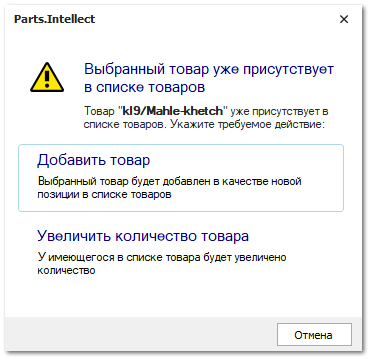

:::

- **Удалить** – позволяет удалить выбранные позиции из табличной части;

- **Действия с позицией** – содержит команду **Добавить в корзину**, которая позволяет добавить, выделенные в табличной части позиции, в корзину;

- **НДС** – содержит ряд команд:

   - **Изменить ставку НДС** – позволяет изменить ставку НДС для выбранных позиций;

   - **Установить приоритет цен с НДС**  – позволяет установить приоритет цен с НДС. При включении переключателя **Выделять НДС** значение в колонке **Цена с НДС** не изменится, а **Цена без НДС** рассчитается на ее основании;

   - **Снять приоритет цен с НДС**  – позволяет снять приоритет цен с НДС. При включении переключателя **Выделять НДС** значение в колонке **Цена без НДС** не изменится, а **Цена с НДС** рассчитается на ее основании;

- **Условное обновление**  – позволяет автоматически включать опцию **Обновить позицию в прайс-листе**. Команда работает для выделенных позиций документа, вызывая диалоговое окно для указания условия обновления цен.

::: info Примечание

При установке обновления позиции указываются тип цены (**Цена закупа в прайс-листе** или **Базовая цена продажи в прайс-листе**), относительно которого допустим рост **Цены закупа** в **Приходной накладной** на указанный процент без обновления прайс-листа.

При оприходовании товара важным является тот факт, что если в **Приходной накладной** есть товар из **Заказа клиента**, то цены в прайс-листе из наличия по данному товару не обновляются. Но, если в прайс-листе из наличия нет данного товара, то информация по нему заносится в обычном порядке.

На обновление **Цены закупа** в прайс-листе наличия также влияет опция **Не уменьшать цену закупа при обновлении прайс-листа из наличия** (меню **Управление ►** **Настройки программы ► Настройки ►** группа **Товары и цены ► Прайс-листы и ценообразование**.

В случае активной опции **Использовать средневзвешенную цену закупа** (только для **Расширенной схемы** ЦО) цена закупа в прайс-лист будет рассчитываться и передаваться из прихода по средневзвешенному алгоритму.

:::

::: note Пример

Цена закупа в прайс-листе из наличия = 100р.

Выбираем включение опции, если Цена закупа больше Цены закупа в прайс-листе, увеличенной на 10 %.

Максимальное допустимое повышение цены закупа без обновления цены в прайс-листе: 100р + 10% = 110р.

Тогда:

- при цене закупа в Приходной накладной 150р опция будет включена, цена закупа будет обновлена, т.к. 150р больше 110р;

- при цене закупа в Приходной накладной 70р – опция будет выключена, цена закупа не будет обновлена, т.к. 70р меньше 110р.

:::

- **Изменить наценку позиций** – позволяет установить наценку, либо скидку на выделенные позиции. На форме указывается от какой цены необходимо начислять наценку или скидку, а также размер скидки/наценки. Далее с помощью опции **Применить правила округления валюты** можно округлить полученное значение. 

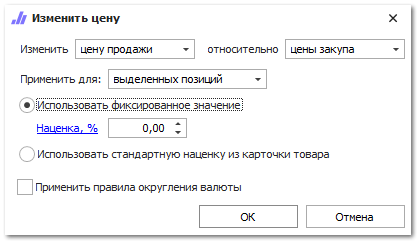

- **Накладные расходы** – позволяет распределить накладные расходы по всем позициям.

 **Найти/Добавить**

Поле предназначено для поиска товара или добавления найденной позиции через проценку по коду детали.

 **Строка информации**

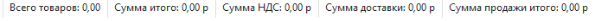

Отображает информацию по позициям в документе:

- **Всего товаров** – количество товаров добавленных в табличную часть;

- **Сумма итого** – суммарная стоимость товаров добавленных в табличную часть;

- **Сумма НДС** – суммарное значение НДС по всем позициям товаров в табличной части;

- **Сумма доставки** – суммарная стоимость доставки для всех товаров;

- **Сумма продажи итого** – итоговая сумма продажи по всем позициям товаров в табличной части.

 **Общее**

Блок содержит поле ввода **Комментария**, которое позволяет оставить комментарий к **Приходная накладная**.

 **Задачи**

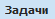

Блок содержит информацию о **Контрагенте**:

- **Контрагент** – отображает следующую информацию:

   - наименование контрагента;

   - **Баланс по заказам** – является суммой значений баланса **Активные заказы** и **Баланса фактического**. Указывает на возможность контрагента оплатить свои заказы;

   - **Баланс фактический** – отражает фактический баланс между накладными, возвратами, корректировками и платежными документами;

   - **Баланс просроченный** – отражает объем отгрузок (**Расходных накладных**), просроченных по оплате в соответствии с значением поля **Отсрочка платежа** для клиента;

   - **Баланс по возвратам** – отражает ситуацию по возвратам, выделяя из **Баланса фактического** сумму возвратов по товарам с учетом платежей;

   - **Код контрагента** – выводит уникальный номер контрагента;

   - **Категория клиента** – отображает категорию, в которой состоит клиент;

- **Блокировка** – статус блокировки контрагента;

- **Контакты** – контактные данные контрагента.

 **Прочие расходы**

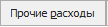

Позволяет внести прочие расходы по документу.

На вкладке отображены блоки:

- **Фильтр** – позволяет задать параметры фильтрации расходов. Команда **Найти** отображает найденные записи в блоке **Платежи**;

- **Платежи** – содержит табличную часть отображающую записи по расходам с группировкой по их виду. Команда **Добавить** добавляет указанную запись в блок **Разнесенные платежи**;

- **Разнесенные платежи** – табличная часть блока отображает связанные с документом платежи. Команда **Удалить** удаляет выделенную запись из таблицы.

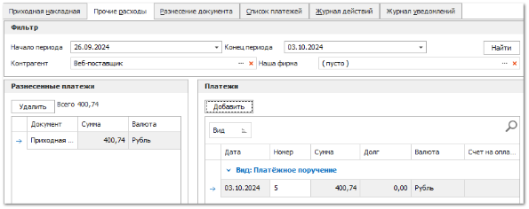

 **Разнесение документа**

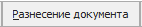

Блок содержит список документов добавленных к разнесению. Команда **Удалить из разнесения** позволяет удалить выбранные позиции из списка. В полях **Остаток по накладным** и **Остаток по заказам** отображаются суммы, доступные для разнесения в рамках данного документа:

- **Остаток по накладным** – разносится на накладные по документам (**РН**, **ПН**, **ВК**, **ВП**);

- **Остаток по заказам** – разносится на заказы (**ЗК**, **ЗП**).

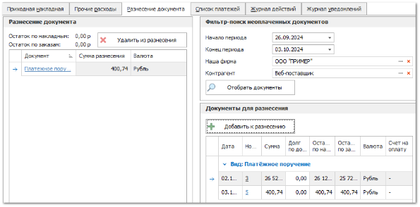

 **Список платежей**

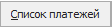

Отображает список платежных документов по документу приходная накладная.

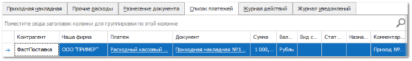

 **Журнал действий**

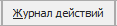

Данный журнал отражает действия всех пользователей с документом.

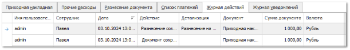

 **Журнал уведомлений**

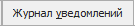

Журнал содержит информацию о работе системы уведомлений клиентов и менеджеров, через Email, SMS и Telegram по документу. В журнал выводятся все события по отправке уведомлений, как успешные, так и нет.

::: info Примечание

Отправка уведомлений через приложение Telegram доступно только для пользователей с подключенным модулем.

:::

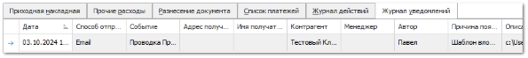