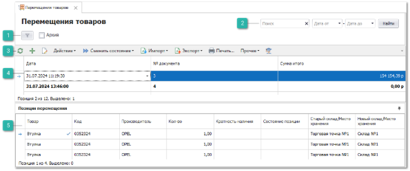
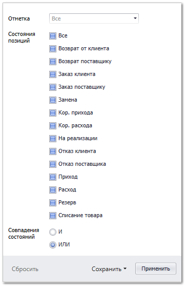
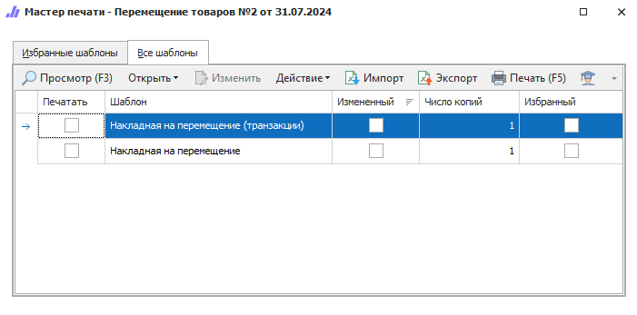

Для перемещения товаров с одного склада на другой, либо на другое место хранения на том же складе, создается документ **Перемещение товара**.

 **Шаблоны фильтров**

Содержит наборы фильтров созданных пользователями. 

Параметр **Архив** отображает/скрывает записи находящиеся в архиве.

Команда  отображает модальное окно с фильтрами по параметрам:

- **Отметка** – фильтрация записей по **Отметкам** документа;

- **Проведен** – фильтрация записей по признаку проведенности документа;

- **Состояния позиций** - фильтрация по конкретным состояниям позиций документа;

- **Совпадения состояний** – позволяет отфильтровать записи по совпадению нескольких состояний одновременно (**ИЛИ**) или при совпадении только указанных (**И**).

Так же окно содержит команды:

- **Сбросить** – сбрасывать фильтрацию по установленным значениям;

- **Сохранить**:

   - **В новый шаблон** – сохраняет установленные значения фильтра в новый шаблон;

   - **В текущий** – сохраняет установленные значения фильтра в текущий шаблон.

 **Фильтр-поиск**

Позволяет произвести фильтрацию документов с помощью полей:

- **Поиск** – фильтрация производится по найденному значению во всех колонках табличной части;

- **Дата от** и **Дата до** – фильтрация по колонке **Дата** от даты начала и до даты окончания.

Кнопка **Найти** позволяет применить заданные параметры фильтра.

 **Панель инструментов**

**Панель инструментов** позволяет осуществить над выбранными документами типа **Задания на разбор товара** ряд действий:

-  – позволяет обновить содержание табличной части. Рекомендуется использовать после внесения массовых изменений;

-  – позволяет открыть окно создания нового документа **Задание на разбор товара**;

-  – позволяет открыть окно редактирования выбранного документа;

- **Действие** – содержит выпадающий список команд:

   - **Удалить** – позволяет удалить выбранные не проведенные документы.

- **Сменить состояние** – содержит выпадающий список команд для изменения состояний документов:

   - **Черновик** – присваивается при создании и первом сохранении документа. При этом доступна возможность полного редактирования документа;

   - **В очереди** – документ находится в очереди на обработку. При этом отсутствует возможность изменять документ;

   - **В работе** – документ находится в работе. В этом состоянии отсутствует возможность работы с документом одновременно нескольким пользователям. Разбор товара сводится к вводу информации об отгруженных товарах;

   - **Выполнено** – обработка задания завершена, выполненное задание можно использовать для создания **Приходной накладной**;

   - **Добавить в Архив** – позволяет добавить документ в **Архив**;

   - **Извлечь из Архива** – позволяет извлечь документ из **Архива**;

- **Создать на основании** –  содержит выпадающий список команд для формирования новых документов на основании отказа:

   - **Задание на отгрузку товара (копия)**;

- **Экспорт** – команда позволяет экспортировать данные из таблицы в файл.

::: note Замечание

Системой поддерживаются следующие форматы выгружаемых файлов:

- Файлы \*.csv с разделителями "точка с запятой", "табуляция";

- Microsoft Excel 2007 (\*.xlsx);

- Таблица XML 2003 (\*.xml);

- MS Access (\*.mdb).

:::

- **Печать** – позволяет открыть окно **Мастер печати** и сформировать печатные бланки** для заказов поставщикам;

-  **Помощь** – позволяет открыть **Руководство пользователя** по разделу.

 **Табличная часть**

**Табличная часть** содержит список **Заданий на разбор товара**, которые были созданы пользователями программы.

::: note Замечание

Список, порядок и отображение колонок в **Табличной части** настраивается индивидуально каждым пользователем программы. Для отображения/скрытия колонок используется команда **Выбор колонок**, которая открывает одноименное окно.

:::

Доступные колонки по позициям в справочнике **Задания на разбор товара**:

- **№ документа** – порядковый номер документа;

- **Oid**** –  уникальный номер позиции документа в базе данных. Присваивается после проведения** документа;

- **Автор** – пользователь, создавший документ;

- **Архив** – статус нахождения документа в архиве;

- **Дата** – дата создания документа;

- **Комментарий** – информация для внутреннего пользования, заполняемая в документе;

- **Наша фирма** – Наша фирма, для которой проводилась инвентаризация;

- **Отметка** – отметка для документа из справочника **Отметки в документах**;

- **Проведен** – статус проведения документа;

- **Системный штрихкод** – внутренний код, который присваивается при создании документа;

- **Состояние позиций** – состояние (и подсостояние)** позиции;

- **Сотрудник. Подразделение** – подразделение сотрудника, который является автором документа;

- **Статус Перемещения** – отображает состояние, в котором находится документ;

- **Сумма итого**** – сумма позиций документа;

- **Торговая точка - автор** – это активная торговая точка пользователя, который является автором документа для выбранной позиции;

- **Транзитный склад** – используется, если перемещение осуществляется между складами и необходимо выделить фазу доставки.

 **Позиции перемещения**

**Позиции документа** содержит позиции в заданиях.

::: note Замечание

Список, порядок и отображение колонок в **Табличной части** настраивается индивидуально каждым пользователем программы. Для отображения/скрытия колонок используется команда **Выбор колонок**, которая открывает одноименное окно.

:::

Доступные колонки по позициям в **Позиции документа:**

- **Альтернативное название** – альтернативное название из карточки товара;

- **Внутренний код** – **Внутренний код** товара из карточки товара;

- **Единица измерения** – указывает **Единица измерения** из карточки товара;

- **Закупочная цена (без НДС)** – цена закупа детали у поставщика;

- **Закупочная цена (с НДС)** – цена закупа детали у поставщика с учетом значения колонки **Ставка НДС, %**;

- **Код** – артикул детали. В поле доступна кнопка , при нажатии на которую открывается окно **Проценки** по данному коду;

- **Кол-во** – количество товара по документу;

- **Кратность наличия** – коэффициент, согласно которому может быть выбрано количество для заказа из наличия. Также выполняет роль минимального количества к заказу;

- **Новый склад/Место хранения**** – указывается склад из выпадающего списка, на который необходимо переместить товар;

- **Плановая дата доставки** – ориентировочная дата доставки заказа с учетом системной даты документа, срока доставки и выходных дней;

- **Производитель** – наименование производителя товара;

- **Состояние позиции** – состояние (и подсостояние)** позиции;

- **Старый склад/Место хранения** – старый склад/место хранения позиции товара;

- **Товар** – наименование детали (из источника позиции);

- **Цена продажи (без НДС)** – цена продажи товара без учета НДС;

- **Цена продажи (с НДС)** – цена продажи товара с учетом процента скидки/наценки по документу (если выделяется НДС).