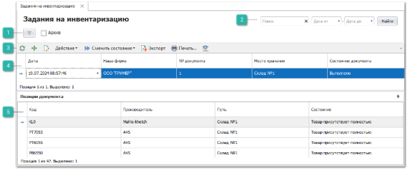
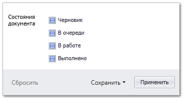

Пункт меню содержит список документов **Задание на инвентаризацию**. Данный тип документа служит для планирования, проведения и фиксации результатов инвентаризации на складе. 

Создать документ можно двумя способами:

перейдите в раздел главного меню **Склад и закупки ► Задания на склад ► Инвентаризация** и создайте новый документ;

перейдите в раздел **Склад и закупки ► Склады/Торговые точки**, выберите склад и нажмите кнопку **Прочее ► Создать задание на инвентаризацию**.

 **Шаблоны фильтров**

Содержит наборы фильтров созданных пользователями. 

Параметр **Архив** отображает/скрывает записи находящиеся в архиве.

Команда  отображает модальное окно с фильтром по параметру **Состояние документа**, которое фильтрует записи табличной части по колонке **Состояние документа**.

Так же окно содержит команды:

- **Сбросить** – сбрасывать фильтрацию по установленным значениям;

- **Сохранить**:

   - **В новый шаблон -** сохраняет установленные значения фильтра в новый шаблон;

   - **В текущий** – сохраняет установленные значения фильтра в текущий шаблон.

 **Фильтр-поиск**

Позволяет произвести фильтрацию документов с помощью полей:

- **Поиск** – фильтрация производится по найденному значению во всех колонках табличной части;

- **Дата от** и **Дата до** – фильтрация по колонке **Дата** от даты начала и до даты окончания.

Кнопка **Найти** позволяет применить заданные параметры фильтра.

 **Панель инструментов**

**Панель инструментов** позволяет осуществить над выбранными документами типа **Задания на инвентаризацию** ряд [действий](#370df7fa-a8cb-49ea-a363-e5760b2f112f):

-  – позволяет обновить содержание табличной части. Рекомендуется использовать после внесения массовых изменений;

-  – позволяет открыть окно создания нового документа **Задание на инвентаризацию**;

-  – позволяет открыть окно редактирования выбранного документа;

- **Действие** – содержит выпадающий список команд:

- **Удалить** – позволяет удалить выбранные не проведенные документы.

   - **Сменить состояние** – содержит выпадающий список команд для изменения состояний документов:

   - **Черновик** – присваивается при создании и первом сохранении документа. При этом доступна возможность полного редактирования документа;

   - **В очереди** – документ находится в очереди на обработку. При этом отсутствует возможность изменять документ;

   - **В работе** – документ находится в работе, проводится инвентаризация на **Складе/торговой точке**. В данном статусе место хранения по документу блокируется, пользователям программы недоступно оприходование и списание товара с него;

   - **Выполнено** – обработка задания завершена, по итогам инвентаризации на основании документа могут быть созданы документы **Приходная накладная** и **Списание товаров**;

   - **Добавить в Архив** – позволяет добавить документ в **Архив**;

   - **Извлечь из Архива** – позволяет извлечь документ из **Архива**.

- **Экспорт** – команда позволяет экспортировать данные из таблицы в файл.

::: note Замечание

Системой поддерживаются следующие форматы выгружаемых файлов:

- Файлы \*.csv с разделителями "точка с запятой", "табуляция";

- Microsoft Excel 2007 (\*.xlsx);

- Таблица XML 2003 (\*.xml);

- MS Access (\*.mdb).

:::

- **Печать** – позволяет открыть окно **Мастер печати** и сформировать печатные бланки** для заказов поставщикам;

 **Помощь** – позволяет открыть **Руководство пользователя** по разделу.

 **Табличная часть**

**Табличная часть** содержит список **Заданий на инвентаризацию**, которые были созданы пользователями программы.

::: note Замечание

Список, порядок и отображение колонок в **Табличной части** настраивается индивидуально каждым пользователем программы. Для отображения/скрытия колонок используется команда **Выбор колонок**, которая открывает одноименное окно.

:::

Доступные колонки по позициям в справочнике **Задания на инвентаризацию**:

- **№ документа** – порядковый номер документа;

- **Архив** – статус нахождения документа в архиве;

- **Дата** – дата создания документа;

- **Место хранения** – Склад/торговая точка, для которой проводилась инвентаризация;

- **Наша фирма** – Наша фирма, для которой проводилась инвентаризация;

- **Состояние документа** – статус выполнения документа.

 **Позиции документа**

- **Позиции документа** содержит список позиций в заданиях.

::: note Замечание

Список, порядок и отображение колонок в **Табличной части** настраивается индивидуально каждым пользователем программы. Для отображения/скрытия колонок используется команда **Выбор колонок**, которая открывает одноименное окно.

:::

Доступные колонки по позициям в **Позиции документа:**

- **Веб-Инфо** – колонка содержит команду вызова окна, содержащего общую информацию и изображения детали из сервиса **Веб-Инфо**;

::: info Примечание

По вопросу подключения сервиса **Веб-Инфо** можно уточнить информацию в отделе продаж Tradesoft.

:::

- **Код** – артикул детали;

- **Количество ожидаемое** **–** общее ожидаемое количество товара на складе;

- **Количество фактическое** **–** общее фактическое количество товара на складе.

- **Название** – наименование товара;

- **Производитель** – наименование производителя товара;

- **Путь** – полный путь до места хранения товара;

- **Состояние** – состояние (и подсостояние) позиции.