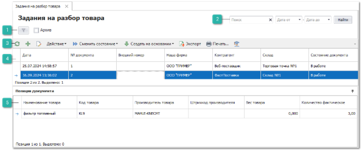
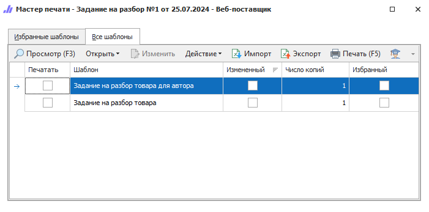

Пункт меню содержит список документов **Заданий на разбор товара**. Документ **Задание на разбор товара** служит для автоматизации и учета результатов процессов:

- занесение информации по товару в документ, который ожидается к оприходованию;

- формирование очереди заданий по разбору грузов на складе;

- непосредственно разбор груза на складе с указанием количества и другой важной информации;

- использованию обработанных заданий для создания **Приходной накладной** с фактически пришедшим товаром;

- передачу информации о взвешивании и штрихкоде производителя в справочник **Товары**, используя команду **Передать в справочник**.

 **Шаблоны фильтров**

Содержит наборы фильтров созданных пользователями. 

Параметр **Архив** отображает/скрывает записи находящиеся в архиве.

Команда  отображает модальное окно с фильтром по параметру **Состояние документа**, которое фильтрует записи табличной части по колонке **Состояние документа**.

Так же окно содержит команды:

- **Сбросить** – сбрасывать фильтрацию по установленным значениям;

- **Сохранить**:

   - **В новый шаблон -** сохраняет установленные значения фильтра в новый шаблон;

   - **В текущий** – сохраняет установленные значения фильтра в текущий шаблон.

 **Фильтр-поиск**

Позволяет произвести фильтрацию документов с помощью полей:

- **Поиск** – фильтрация производится по найденному значению во всех колонках табличной части;

- **Дата от** и **Дата до** – фильтрация по колонке **Дата** от даты начала и до даты окончания.

Кнопка **Найти** позволяет применить заданные параметры фильтра.

 **Панель инструментов**

**Панель инструментов** позволяет осуществить над выбранными документами типа **Задания на разбор товара** ряд действий:

-  – позволяет обновить содержание табличной части. Рекомендуется использовать после внесения массовых изменений;

-  – позволяет открыть окно создания нового документа **Задание на разбор товара**;

-  – позволяет открыть окно редактирования выбранного документа;

- **Действие** – содержит выпадающий список команд:

   - **Удалить** – позволяет удалить выбранные не проведенные документы.

- **Сменить состояние** – содержит выпадающий список команд для изменения состояний документов:

   - **Черновик** – присваивается при создании и первом сохранении документа. При этом доступна возможность полного редактирования документа;

   - **В очереди** – документ находится в очереди на обработку. При этом отсутствует возможность изменять документ;

   - **В работе** – документ находится в работе. В этом состоянии отсутствует возможность работы с документом одновременно нескольким пользователям. Разбор товара сводится к вводу информации об отгруженных товарах;

   - **Выполнено** – обработка задания завершена, выполненное задание можно использовать для создания **Приходной накладной**;

   - **Добавить в Архив** – позволяет добавить документ в **Архив**;

   - **Извлечь из Архива** – позволяет извлечь документ из **Архива**.

- **Создать на основании** – содержит выпадающий список команд для формирования новых документов на основании отказа:

   - **Задание на отгрузку товара (копия)**;

- **Экспорт** – команда позволяет экспортировать данные из таблицы в файл.

::: note Замечание

Системой поддерживаются следующие форматы выгружаемых файлов:

- Файлы \*.csv с разделителями "точка с запятой", "табуляция";

- Microsoft Excel 2007 (\*.xlsx);

- Таблица XML 2003 (\*.xml);

- MS Access (\*.mdb).

:::

- **Печать** – позволяет открыть окно **Мастер печати** и сформировать печатные бланки** для заказов поставщикам;

-  **Помощь** – позволяет открыть **Руководство пользователя** по разделу.

 **Табличная часть**

**Табличная часть** содержит список **Заданий на разбор товара**, которые были созданы пользователями программы.

::: note Замечание

Список, порядок и отображение колонок в **Табличной части** настраивается индивидуально каждым пользователем программы. Для отображения/скрытия колонок используется команда **Выбор колонок**, которая открывает одноименное окно.

:::

Доступные колонки по позициям в справочнике **Задания на разбор товара**:

- **№ документа** – порядковый номер документа;

- **Автор** – пользователь, создавший документ;

- **Архив** – статус нахождения документа в архиве;

- **Внешний номер** – внешний номер документа;

- **Дата** – дата создания документа;

- **Комментарий** – информация для внутреннего пользования, заполняемая в документе;

- **Контрагент** – наименование поставщика, у которого осуществляется заказ;

- **Наша фирма** – Наша фирма, для которой проводилась инвентаризация;

- **Системный штрихкод** – внутренний код, который присваивается при создании документа;

- **Склад** – место хранения позициий документа;

- **Состояние документа** – статус выполнения документа;

- **Сотрудник. Подразделение** – подразделение сотрудника, который является автором документа.

 **Позиции документа**

**Позиции документа** содержит позиции в заданиях.

::: note Замечание

Список, порядок и отображение колонок в **Табличной части** настраивается индивидуально каждым пользователем программы. Для отображения/скрытия колонок используется команда **Выбор колонок**, которая открывает одноименное окно.

:::

Доступные колонки по позициям в **Позиции документа:**

- **Валюта** – валюта, в которой указаны цены на позицию;

- **Вес товара** – вес товара;

- **Закупочная цена** – цена закупа детали у поставщика;

- **Код контрагента** – порядковый номер поставщика из справочника контрагентов;

- **Код товара** – артикул детали;

- **Количество ожидаемое** **–** общее ожидаемое количество подготовленного к отгрузке товара;

- **Количество фактическое** **–** общее фактическое количество подготовленного к отгрузке товара;

- **Наименование клиента** – название клиента, на основе заказа которого создана расходная накладная.

- **Наименование товара** – наименование товара;

- **Новый код товара** – артикул товара, являющегося заменой**;**

- **Номер ГТД** – номер грузовой таможенной декларации, если деталь была импортирована в страну;

- **Номер заказа поставщику** – порядковый номер документа **Заказ поставщику**, на основе которого сформирован **Разбор товара**;

- **Примечание** – дополнительная информация по позиции;

- **Производитель товара** – наименование производителя товара;

- **Страна** – значение **Страна-изготовитель** из карточки товара;

- **Штрихкод производителя** – штрихкод производителя из источника позиции.