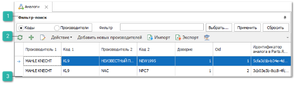
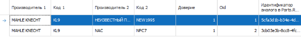
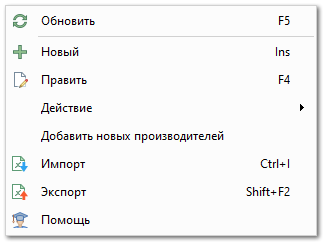

Справочник содержит список взаимозаменяемых деталей. Для каждой детали ставится в соответствие код и производитель другой детали, которая является ее аналогом. Если нет в наличии детали, которая необходима для заказа, можно заменить эту позицию ее аналогом.

 **Панель Фильтр-поиск**

Панель **Фильтр-поиск** позволяет задать фильтры для поиска товара и содержит:

- **Коды** – позволяет выбрать поиск по артикулу товара;

- **Производители** – позволяет выбрать поиск по производителю товара;

- **Фильтр** – позволяет ввести значение для поиска;

- **Выбрать** – позволяет открыть справочник Производители и выбрать производителя в фильтр;

- **Применить –** позволяет применить заданные фильтры;

- **Сбросить** – позволяет сбросить заданные фильтры.

 **Панель инструментов**

Панель инструментов содержит следующие команды:

- **Обновить** () – позволяет обновить табличную часть;

- **Новый** () – позволяет открыть окно добавления записи аналогов;

- **Править** () – позволяет отредактировать выбранную запись аналогов;

- **Действие** – содержит выпадающий список команд:

    - **Удалить** – позволяет удалить выбранную запись;

    - **Показать все аналоги товара** – позволяет открыть страницу [**Связанные аналоги**](./svjazannye_analogi.md) по выбранной записи аналогов. Оригинальным товаром будет товар с артикулом из колонки **Код 1**;

    - **Установить доверие** – позволяет установить признак доверия в выбранной записи аналогов;

    - **Отменить доверие** – позволяет убрать признак доверия в выбранной записи аналогов;

    - **Удалить дубликаты** – позволяет удалить все повторяющиеся записи аналогов;

- **Импорт** – позволяет массово загрузить аналоги в справочник;

- **Экспорт** – позволяет выгрузить таблицу аналогов в файл формата CSV;

- **Помощь** () – позволяет открыть руководство пользователя на странице описания раздела **Аналоги**;

- **Добавить новых производителей** – позволяет добавить новых производителей из базы данных Parts.Intellect на сайт Parts.Resource.

::: info Примечание

Команда **Добавить новых производителей** доступна при подключенной услуге **Синхронизатор**. Подробнее читайте в [руководстве пользователя](https://product-doc.tradesoft.ru/ai_ar/5.8/index.htm).

:::

 **Табличная часть**

Табличная часть содержит следующие колонки:

- **Производитель 1** – отображает производителя 1-го товара в записи;

- **Код 1** – отображает артикул 1-го товара в записи;

- **Производитель 2** – отображает производителя 2-го товара в записи

- **Код 2** – отображает артикул 2-го товара в записи;

- **Доверия** – отображает признак доверия;

- **Oid** – отображает идентификатор записи

- **Идентификатор аналога в Parts.Resource** – отображает идентификатор записи аналогов в Parts.Resource.

::: info Примечание

Данные в колонке **Идентификатор аналога в Parts.Resource** доступны при подключенной услуге **Синхронизатор**. Подробнее читайте в [руководстве пользователя](https://product-doc.tradesoft.ru/ai_ar/5.8/index.htm).

:::

Также табличная часть содержит список команда контекстного меню, которые дублируют команды с панели инструментов.

