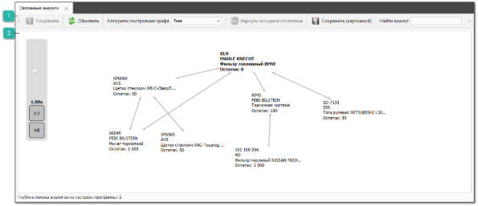
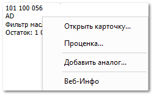

Раздел **Связанные аналоги** содержит:

 **Панель инструментов**

Панель инструментов содержит следующие команды:

- **Сохранить** – позволяет сохранить внесенные изменения в связях аналогов;

- **Отменить** – позволяет отменить внесенные изменения в связях аналогов;

- **Вернуть** – позволяет вернуть на шаг назад внесенные изменения в связях аналогов;

- **Алгоритм построения графа** – позволяет выбрать режим построения древа аналогов;

- **Вернуть исходное состояние** – позволяет вернуть изменения в связях аналогов в исходное состояние;

- **Сохранить (картинкой)** – позволяет выгрузить рабочую область изображением формата JPEG в папку на компьютер;

- **Найти аналог** – позволяет найти аналог по наименованию, артикулу и производителю;

- **Путь до аналога** – позволяет отобразить все аналоги, из которых выстраивается путь от изначального товара к искомому аналогу. Опция доступна, если в поле **Найти аналог** введено значение.

 **Рабочая область**

Рабочая область содержит:

- шкалу, которая позволяет позволяет изменять масштаб рабочей области. Шкала также содержит команды:

    - **1:1** – позволяет привести рабочую область к масштабу 1:1

    - **Fill** – позволяет увеличить/уменьшить масштаб рабочей области, чтобы в ней поместилось все древо аналогов;

- древо аналогов. Жирным шрифтом выделяется оригинальный товар;

::: info Примечание

Для перемещения аналога наведите на него и зажмите левую кнопку мыши.

:::

- контекстное меню аналога, которое открывается при нажатии ПКМ на аналог. Меню содержит команды:

    - **Открыть карточку** – позволяет открыть карточку товара;

    - **Проценка** – позволяет открыть вкладку **Проценка**. В поле **Поиск** автоматически подставится артикул аналога;

    - **Добавить аналог** – позволяет открыть окно мастер добавления аналога с выбранным аналогом;

    - **Веб-инфо** – позволяет открыть окно **Веб-инфо** с информацией о товаре.

- контекстное меню связи, которое открывается при нажатии ПКМ на связь между аналогами. Меню содержит команды:

    - **Удалить связь** – позволяет удалить связь между аналогами;

    - **Установить доверие** – позволяет установить доверие между аналогами;

    - **Удалить доверие** – позволяет удалить доверие между аналогами.

