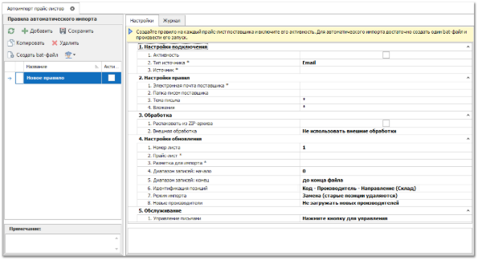

Модуль **Автоимпорт прайс-листов** позволяет автоматизировать сбор прайс-листов поставщиков с указанных почтовых ящиков и FTP-серверов для последующего обновления в программе. По созданным в программе правилам осуществляется поиск писем с файлами (прайс-листами) и сбор файлов с ftp-серверов с их последующей загрузкой в программу.

Окно инструмента содержит блок **Правила автоматического импорта**, вкладки **Настройки** и **Журнал**.

Содержание блоков **Правила автоматического импорта** и **Журнал** идентичны аналогичным блокам в разделе **Автоимпорт заказов клиентов**.

Вкладка **Настройки** предназначена для настройки правил загрузки и обновления прайс-листов. Для каждого прайс-листа поставщика необходимо создавать отдельное правило на загрузку и обновление прайс-листа в программе.