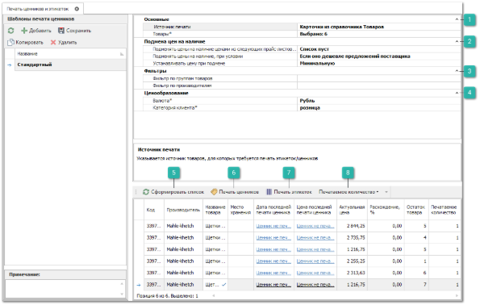
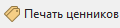
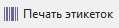

Печать ценников или этикеток возможно из разных разделов программы (из справочника **Товары**, из документов прихода, заданий и т.д.), но основным является **Мастер печати ценников**.

Данный мастер позволяет распечатать ценники либо этикетки из разных источников:

- **Карточки из справочника Товаров.** В этом случае товары для печати отбираются из справочника **Товаров**;

- **Наличие на Складах/ТТ/МХ**. В этом случае товары для печати отбираются с выбранного Склада/ТТ/МХ, те, которые на нем в наличии;

- **Документы: Приходные накладные**. В этом и последующих вариантах товары отбираются из позиций выбранных документов;

- **Документы: Возвраты клиента**;

- **Документы: Перемещения**.

Панель действий содержит стандартные команды и некоторые уникальные команды:

 **Основные** 

Блок настроек позволяет указать:

- **Источник печати** – указывается источник товаров, для которых требуется печать этикеток/ценников;

- **Товары\*** – указывается один или несколько товаров из справочника **Товары**, для которых требуется печать этикеток/ценников.

 **Подмена цен на наличие**

Блок настроек позволяет указать:

- **Подменять цены на наличие ценами из следующих прайс-листов от поставщиков** – если указаны прайс-листы от поставщиков, то цены на товары в наличии будут подменяться ценами на такие же товары из выбранного прайс-листа поставщика;

- **Подменять цены на наличие, при условии** – опция определяет у каких позиций товаров производить подмену цен и отбирает подходящие предложения. Подменять цены можно всегда или только если цена поставщика ниже/выше цены продажи по наличию;

- **Устанавливать цену при подмене** – опция определяет на какую цену подменять (минимальную, максимальную или среднюю), если на этапе отбора предложений найдено несколько предложений поставщиков с разными ценами.

 **Фильтры**

Позволяет задать фильтры которые отсеивают изначально выбранные товары:

- **Фильтр по группам товаров** – позволяет указать необходимые группы товаров;

- **Фильтр по производителям** – позволяет указать необходимых производителей.

 **Ценообразование**

Блок настроек позволяет указать:

- **Валюта\*** – указывается валюта для подбора цен на товар в наличии;

- **Категория клиента\*** – указывается категория клиента для подбора цен на товар в наличии.

 **Сформировать список**

Позволяет сформировать список товаров на основании заданных настроек.

::: info Примечание

Колонка **Остаток товара** списка сформированных позиций содержит информацию по количеству товара на доступных для пользователя складах.Если в качестве **Источника печати** выбрано значение **Наличие на Складах/ТТ/МХ**, то колонка **Остаток товара** содержит информацию по наличию на выбранном месте хранения. В случае, если выбрано несколько мест хранения, для каждого из них формируется отдельная строчка с позицией и остатком товара.

:::
 **Печать ценников**

Позволяет осуществить печать ценников для выделенных позиций, факт печати (нажатие кнопки печать в мастере печати) отражается в журнале. Затем в позициях мастера, в колонках с последней датой и ценой печати ценников, через гиперссылку можно открыть окно с историей печати: кто, с какого компьютера, когда, какое количество ценников и с какой ценой печатал.

 **Печать этикеток**

Позволяет осуществить печать этикеток для выделенных позиций без сохранения информации в журнал.

 **Печатаемое количество**

Позволяет массово проставить печатаемое количество для выбранных позиций: равное 1, остатку, количеству по документу или ввести вручную.