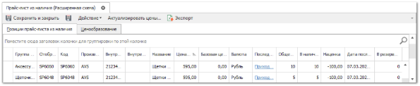
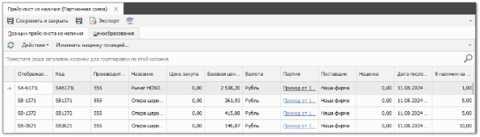
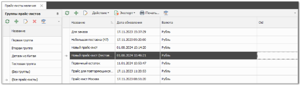

Раздел **Прайс-лист наличия** содержит информацию о товарах на складе, их количестве и цене. В зависимости от схемы ценообразования работа с прайс-листами из наличия имеет свои особенности:

- **Расширенная** – единственный прайс-лист формируется на основании товаров из **Приходных накладных**. Причем, если товар из **Приходной накладной** уже есть в прайс-листе, то информация о цене закупа либо считается по средневзвешенному алгоритму (включена опция **Использовать средневзвешенную цену закупа**), либо обновляется в прайс-листе в зависимости от опции **Позиции ПН. Обновить позицию в прайс-листе (по умолчанию)** в **Настройках пользователя**. В этих алгоритмах не участвуют позиции ПН, которые пришли под клиентов. Также не обновляется цена и при проведении документа **Возврат от клиента**;

- **Партионная** – единственный прайс-лист формируется на основании позиций из **Приходных накладных**. Причем из каждой **Приходной накладной** все позиции уходят в **Прайс-лист наличия** отдельными строками. Для каждой партии товара в прайс-листе существует возможность указать свою цену. Соответственно, в проценке можно выбирать для продажи любую партию;

- **Гибкая** – доступна возможность вводить неограниченное количество **Прайс-листов наличия**. Товар в прайс-лист попадает из ПН, другого прайс-листа либо справочника **Товары**. В алгоритме добавления/обновления позиции прайс-листа при проводке ПН не участвуют позиции документа, которые пришли под клиентов.

::: note Замечание

На **Гибкой** СЦО в разделе доступна панель **Группа прайс-листов**, которая позволяет распределить прайс-листы по группам для более гибкой настройки доступа.

:::