Раздел **Прайс-листы поставщиков** содержит список прайс-листов.

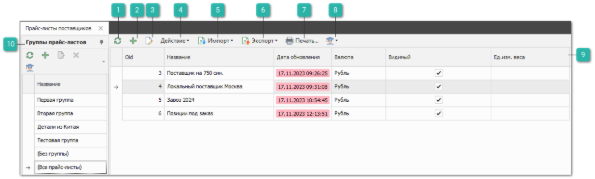

 **Обновить**

Позволяет обновить табличную часть раздела.

 **Новый**

Позволяет создать новую запись прайс-листа от поставщика.

 **Править**

Позволяет открыть инспектор прайс-листа от поставщика.

 **Действие**

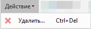

Позволяет раскрыть список команд:

- **Удалить** – позволяет удалить выбранную запись прайс-листа от поставщика.

 **Импорт**

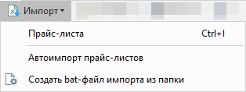

Позволяет раскрыть список команд импорта:

- **Прайс-листа** – позволяет открыть окно импорта прайс-листа;

- **Автоимпорт прайс-листов** – по нажатию открывается страница для создания нового правила автоматического импорта прайс-листов (раздел **Товары и цены** **► Дополнительные действия с прайс-листами ► Автоимпорт прайс-листов**). Доступна в выпадающем списке команд **Импорт**;

- **Создать** **bat-файл импорта из папки** – позволяет создать исполняемый файл для автоматизации процесса загрузки прайс-листов поставщиков.

 **Экспорт**

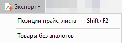

Команда позволяет экспортировать данные из таблицы в файл:

- **Товары без аналогов** – позволяет экспортировать все позиции за исключением их аналогов;

- **Позиции прайс-листа** – позволяет экспортировать все позиции, при вызове команды откроется окно **Выбора колоно**к, позволяющее выбрать необходимые для экспорта колонки, а так же установить их порядок в экспортируемом файле.

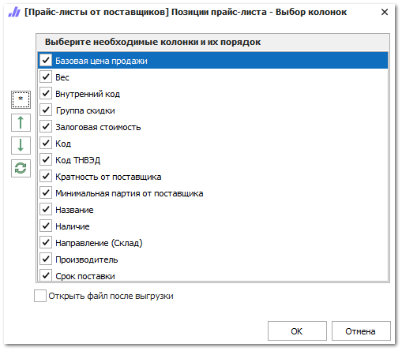

Окно содержит кнопки:

-  – позволяет выбрать все позиции из списка колонок;

-  – позволяют переместить позиции в списке, тем самым изменить порядок колонок в выгружаемом файле;

-  – позволяет сбросить установленные ранее настройки.

 **Печать**

Позволяет открыть окно мастера печати отчетов.

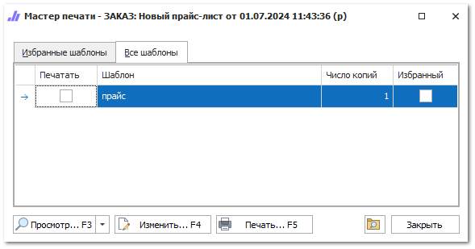

 **Помощь**

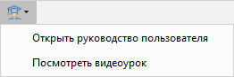

Позволяет раскрыть список команд:

- **Открыть руководство пользователя** – позволяет открыть руководство пользователя на странице описания функционала раздела;

- **Посмотреть видеоурок** – позволяет открыть видеоурок по разделу.

 **Табличная часть**

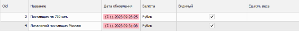

Содержит список записей прайс-листов от поставщиков.

 **Панель групп**

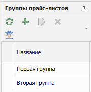

Содержит список групп прайс-листов.

Панель **Группы прайс-листов** содержит:

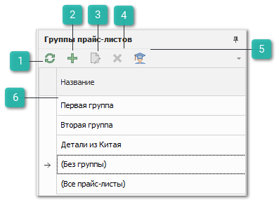

 **Обновить**

Позволяет обновить табличную часть.

 **Новый**

Позволяет открыть инспектор для добавления новой группы.

 **Править**

Позволяет открыть инспектор для редактирования информации группы.

 **Удалить**

Позволяет удалить выбранную группу.

 **Помощь**

Позволяет открыть руководство пользователя.

 **Табличная часть**

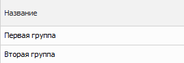

Содержит **Названия** групп прайс-листов, а также предустановленные фильтры:

- **(Без группы)** – позволяет отобразить все прайс-листы, для который не установлена группа;

- **(Все прайс-листы)** – позволяет отобразить все прайс-листы без фильтрации по группе.

В форме редактирования прайс-листа, помимо основных свойств можно выделить секции:

- **Считать нулевым предложением позиции с**, содержит опции:

    - **Незаполненным значением наличия** – в данном случае нулевым предложением будут считаться позиции от поставщика, в которых не заполнена колонка с наличием;

    - **Наличием, заданным в виде строки без чисел** – нулевым предложением будет считаться позиции от поставщика, если он передал наличие текстом, в котором не встречаются числа.

- **Возможность возврата**, содержит опции:

    - **Возможность возврата** – позволяет выбрать условие возврата:

        - **Не указано** – у всех товаров прайс-листа от поставщика не будет отображаться признак возможности возврата;

        - **Возврат возможен** – для всех товаров прайс-листа от поставщика устанавливается значение «Возврат возможен»;

        - **Возврат невозможен** – для всех товаров прайс-листа от поставщика устанавливается значение «Возврат невозможен»;

        - **Возврат с условием** – для всех товаров от прайс-листа от поставщика устанавливается значение «Возврат с условием». При наведении на иконку признака возврата в окне проценки или других документах отображается условие, указанное в опции «Условия возврата»;

    - **Условия возврата** – позволяет задать условие возврата. Для переноса строки необходимо добавить символы «\n». Поле доступно, если в опции «Возможность возврата» выбрано значение «Возврат с условием».

::: info Примечание

Настроенный признак возможности возврата всегда отображается в проценке. В других разделах программы признак возможности возврата отображается, если у выбранного прайс-листа настроен маркетинг (**Товары и цены** **► Правила ценообразования (маркетинги)**).

:::