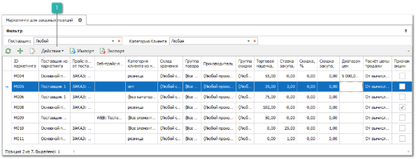
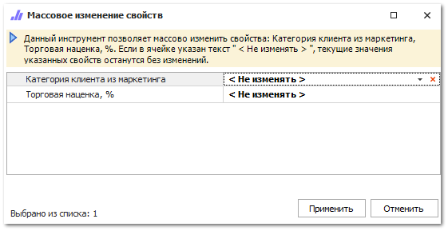

Ценообразование в программе **Parts.Intellect** задается через прайс-листы и сформированные для них маркетинги. Для прайс-листов формируются различные маркетинги, в зависимости от количества существующих критериев расчета цен для клиентов.

Панель действий содержит стандартные команды и некоторые уникальные команды:

 **Действие**

При вызове команды **Импорт** доступен новый пункт **Массовое изменение свойств**, позволяет массово изменить значение параметров **Категория клиента из маркетинга** и **Торговая наценка, %** у выбранных маркетингов.

Маркетинги для товаров в наличии находятся в пункте меню **Товары и цены ► Прайс-листы  наличия**, на вкладке **Ценообразование**.

::: info Примечание

При изменении значений проводится проверка на наличие дубликатов. В случае совпадения всех настроек хотя бы у двух выбранных маркетингов изменения не применятся и будет выведен лог с описанием ошибки.

:::