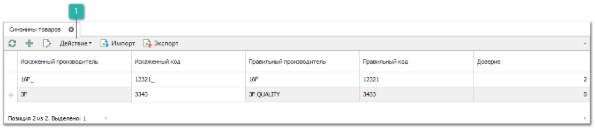

Справочник **Синонимы товара** используется для добавления связи искаженных артикулов и их реальных написаний. Каждая запись справочника содержит пару **Искаженные код/производитель – Правильные код/производитель**. 

Панель действий содержит стандартные команды и некоторые уникальные команды:

 **Действие**

При вызове команды **Действие** доступны новые пункты:

- **Установить доверие** – позволяет установить уровень доверия для пары синонимов товаров равный 1;

- **Отменить доверие** – позволяет установить уровень доверия для пары синонимов товаров равный 0.

Способы применения:

- поставщик присылает прайс-лист, в котором артикулы искажены (добавлены символы, либо вообще его внутренний код товара). При добавлении таблицы синонимов при поиске оригинального артикула товара программа найдет соответствующую ее позицию в прайс-листе поставщика;

- клиент на сайте и менеджер в программе могут искать как по правильным кодам, так и искаженным;

- на этапе импорта программа может принимать файл с искаженными артикулами, понимая о каких товарах идет речь;

- справочник **Товаров** не "засоряется" несколькими карточками на один и тот же товар и т.д.