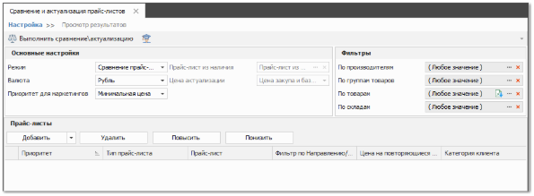
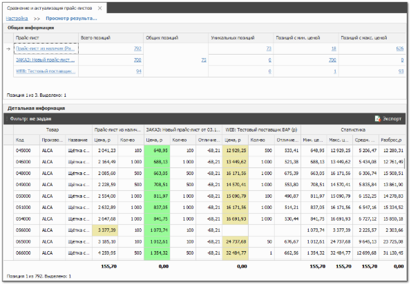

Модуль **Сравнение и актуализация прайс-листов** позволяет сравнить и актуализировать цены на товары в прайс-листах, загруженных в программу **Parts.Intellect**.

::: info Примечание

Раздел **Сравнение и актуализация прайс-листов** доступен только при наличии подключенной услуги. Условия подключения можно узнать в отделе продаж компании Tradesoft.

:::

Раздел содержит:

- шаг **Настройка**, который позволяет:

    - выбрать режим работы: **Сравнение прайс-листов** или **Актуализация по минимальной цене поставщиков**;

    - задать необходимые параметры в блоке **Основные настройки** и параметры фильтрации в блоке **Фильтры**;

    - выбрать прайс-листы для сравнения/актуализации в блоке **Прайс-листы**.

- шаг **Просмотр результатов**, который содержит подробную информацию в виде таблицы по обоим режимам работы. В режиме **Актуализация по минимальной цене поставщиков** можно произвести актуализацию цен.

Сравнение и актуализация прайс-листов позволяет решить задачи:

- сравнение собственных цен с ценами конкурентов или партнеров для выстраивания собственной ценовой политики и обеспечения конкурентного преимущества;

- сравнение цен различных поставщиков для выбора поставщика с наилучшим предложением;

- сравнение цен в прайс-листах поставщика для контроля изменения цен и ассортимента;

- массовая и быстрая актуализация цен прайс-листа из наличия по минимальной цене от поставщика.

::: info Примечание

Подробнее о работе модуля читайте в [руководстве пользователя](https://product-doc.tradesoft.ru/ai/price_analysis/index.htm).

:::