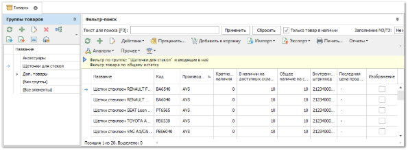

Справочник **Товары** содержит данные о товарах, которые присутствуют в ассортименте компании.

Справочник состоит из иерархических **Групп товаров**, в которых содержатся товары. Уровень вложенности групп не ограничен, но рекомендуется использовать не более 4х уровней.

**Рабочая область** включает следующие элементы: **Фильтр-поиск**, **Панель инструментов**, **Табличная часть**.

В справочнике можно вывести дополнительные фильтры и панели с различной информацией о товарах. Активировать опции можно отдельно для каждого пользователя в разделе **Управление ► Настройки пользователя**, вкладка **Товар**.