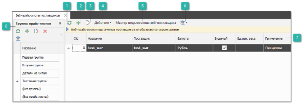
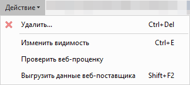
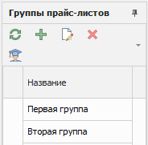

Сервис **Веб-поставщики** позволяет подключать сайты известных поставщиков автозапчастей к программе. Данный сервис используется для получения актуальных цен и информации о наличии деталей на складах.

При этом, в системе сохраняются только реквизиты пользователя для выбранного сайта поставщика, а номенклатура и цены запрашиваются при каждом поиске из окна **Проценки**. Данный функционал предоставляется через дополнительный платный веб-сервис, более подробную информацию можно узнать на сайте [www.tradesoft.ru](http://www.tradesoft.ru/).

 **Обновить**

Позволяет обновить табличную часть раздела.

 **Новый**

Позволяет добавить новую запись веб-прайс-листа от поставщика.

 **Править**

Позволяет открыть инспектор веб-прайс-листа от поставщика для редактирования записи.

 **Действие**

Позволяет раскрыть список команд:

- **Удалить** – позволяет удалить выбранную запись прайс-листа от поставщика;

- **Проверить веб-проценку** – вызов инструмента для проверки результатов веб-проценки;

- **Изменить видимость** – позволяет переключить значение в колонке **Видимый** и отключить прайс-лист;

- **Выгрузить данные веб-поставщика** – команда экспорта данных из таблицы в файл.

::: note Замечание

Системой поддерживаются следующие форматы выгружаемых файлов:

- Файлы \*.csv с разделителями "точка с запятой", "табуляция";

- Microsoft Excel 2007 (\*.xlsx);

- Таблица XML 2003 (\*.xml);

- MS Access (\*.mdb).

:::

 **Мастер подключения веб-поставщика**

Позволяет вызвать инструмент **Мастер подключения веб-поставщика**, который позволяет заполнить минимальное количество параметров и настроить новое подключение.

 **Помощь**

Позволяет раскрыть список команд:

- **Открыть руководство пользователя** – позволяет открыть руководство пользователя на странице описания функционала раздела;

- **Посмотреть видеоурок** – позволяет открыть видеоурок по разделу.

 **Табличная часть**

Содержит список записей веб-прайс-листов от поставщиков.

 **Панель групп**

Содержит список групп прайс-листов.

Панель **Группы прайс-листов** содержит:

 **Обновить**

Позволяет обновить табличную часть.

 **Новый**

Позволяет открыть инспектор для добавления новой группы.

 **Править**

Позволяет открыть инспектор для редактирования информации группы.

 **Удалить**

Позволяет удалить выбранную группу.

 **Помощь**

Позволяет открыть руководство пользователя.

 **Табличная часть**

Содержит **Названия** групп прайс-листов, а также предустановленные фильтры:

- **(Без группы)** – позволяет отобразить все прайс-листы, для который не установлена группа;

- **(Все прайс-листы)** – позволяет отобразить все прайс-листы без фильтрации по группе.