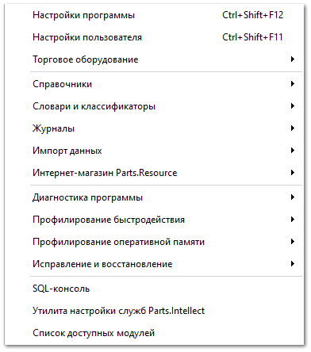

Через пункт **Управление** осуществляются настройки программы и ведение основных справочников. Данный раздел доступен только администратору базы данных и скрыт для других пользователей.

Администратор имеет возможность глубокой настройки программы (а именно базы данных). Управление программой разбито на несколько разделов: **Роли пользователей** (разрешения), **Пользователи**, **Настройки** и **Наши фирмы**.

Большинство изменений прав доступа для пользователей и настроек программы вступают в силу только после выхода и последующего входа в базу данных (то есть если пользователь в данный момент работает в программе, то у него действуют настройки, которые были при входе в нее). Для применения настроек со стороны администратора, необходимо закрыть вкладку **Настройки программы**.

