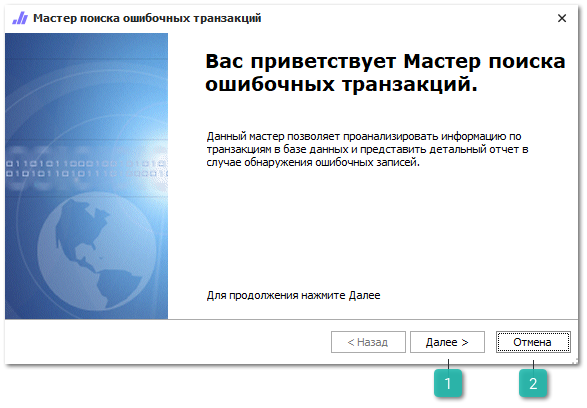
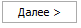
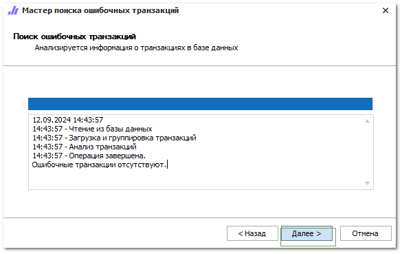
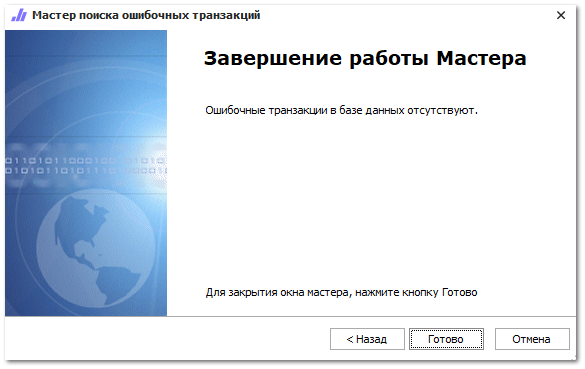

Данный мастер позволяет проанализировать информацию по транзакциям в базе данных и представить детальный отчет в случае обнаружения ошибочных записей.

 **Далее** 

Позволяет перейти к следующему шагу **Мастера поиска ошибочных транзакций**.

 **Отмена**

Позволяет завершить работу **Мастера поиска ошибочных транзакций**.

Посла нажатия на кнопку **Далее** отобразится ход работы мастера и результат работы.

По завершении операции при нажатии кнопки **Далее** отобразится последний шаг работы мастера с его результатами.

