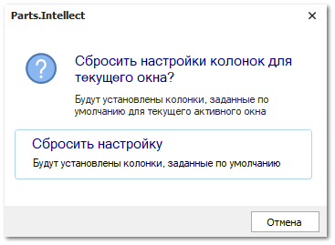
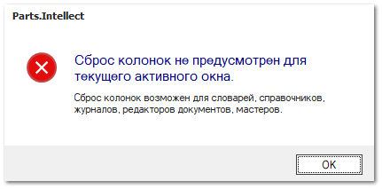

Данный инструмент позволяет сбросить пользовательские наборы и настройки колонок до значений по умолчанию в словарях, справочниках, журналах, редакторах документов и мастерах. Вызов команды необходимо осуществлять при открытом окне, где необходимо осуществить сброс настроек колонок.

В случае если сброс колонок для окна невозможен отобразится соответствующее уведомление.

