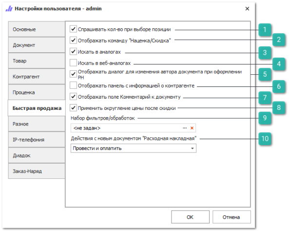
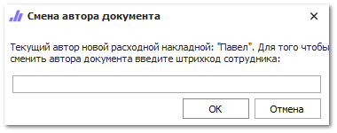

Вкладка содержит настройки для инструмента **Быстрая продажа**.

 **Спрашивать кол-во при выборе позиции**

Регулирует появление диалога с запросом количества при выборе товаров. По умолчанию добавляется 1 шт.

 **Отображать команду "Наценка/Скидка"**

Активирует команду **Наценка/Скидка**.

::: note Заметка

Изменение цены с помощью команды **Наценка/Скидка** может быть недоступно пользователю, при отключенном разрешении **Можно изменять цену продажи** **в Быстрой продаже** для документа **Расходная накладная** в разделе меню **Управление ► Настройки программы ► Роли пользователей**.

:::

 **Искать в аналогах**

Позволяет активировать использование справочника **Аналоги** при подборе товаров. В результатах подбора отобразится наличие запрошенного товара и его аналоги.

 **Искать в веб-аналогах**

Позволяет активировать использование сервиса **Веб-аналоги** (при активной подписке) при подборе товаров. В результатах отобразится наличие запрошенного артикула и его аналоги.

 **Отображать диалог для изменения автора документа при оформлении РН**

Регулирует,  при оформлении продажи (нажатие кнопки **Оформить**), отображение пользователю диалогового окна для ввода **Штрихкода сотрудника**, который станет автором документа **Расходная накладная**. 

Если ввести **Штрихкод сотрудника** (значение колонки **Системный штрихкод** в справочнике **Сотрудников**), то этот сотрудник подставится в качестве автора **Расходной накладной**. Если автора документа не нужно изменять, достаточно не заполнять штрихкод и нажать кнопку **ОК**. При нажатии кнопки **Отмена**, программа вернет пользователя в окно **Быстрой продажи**.

 **Отображать панель с информацией о контрагенте**

Позволяет включить отображение информации по балансам, блокировкам и контактным данным контрагента.

 **Отображать поле Комментарий к документу**

Позволяет отобразить поле для ввода **Комментарий к документу** на панели оформления продажи.

 **Применить округление цены после скидки**

Опция позволяет включить механизм округления итоговой суммы после применения скидки. 

::: note Заметка

Округление итоговой суммы производится согласно установленному округлению цен валюты в разделе **Финансы** ► **Валюты** **и курсы**. 

:::

 **Набор фильтров/обработок**

Позволяет задать набор с фильтрами/обработками, которые требуется применять при подборе цен на товары.

 **Действие с новым документом "Расходная накладная"**

Позволяет задать действие, которое будет выполняться по умолчанию при выполнении команды **Оформить**.

