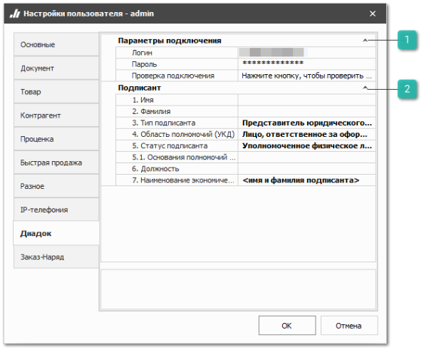
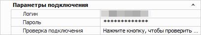
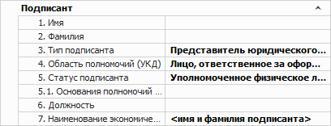
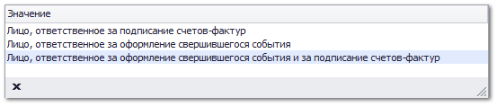
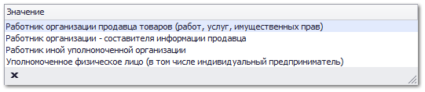

Вкладка содержит настройки для интеграции с системой Диадок.

::: info Примечание

Подробнее о работе с сервисом **Диадок** читайте в [руководстве пользователя](https://product-doc.tradesoft.ru/ai/diadok/index.htm).

:::

 **Параметры подключения**

Блок содержит следующие опции:

- **Логин** – позволяет указать логин для подключения к сервису Диадок;

- **Пароль** – позволяет указать пароль для подключения к сервису Диадок;

- **Проверка подключения** – позволяет проверить подключение к сервису Диадок.

 **Подписант**

Блок содержит следующие опции:

- **1. Имя** – позволяет указать имя подписанта.

- **2. Фамилия** – позволяет указать фамилию подписанта.

- **3. Тип подписанта** – позволяет выбрать тип подписанта:

    - представитель юридического лица;

    - индивидуальный предприниматель;

    - физическое лицо;

- **4. Область полномочий (УКД)** – позволяет выбрать область полномочий подписанта для документа УКД;

- **5. Статус подписанта** – позволяет выбрать статус подписанта;

- **5. 1. Основания полномочий (доверия)** – позволяет указать основания полномочий подписанта;

- **6. Должность** – позволяет указать должность подписанта;

- **7. Наименование экономического субъекта** – позволяет указать имя и фамилию подписанта.