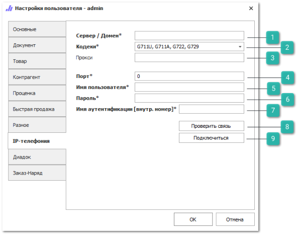
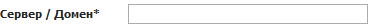
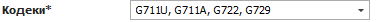
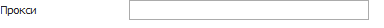
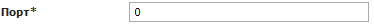
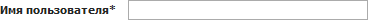
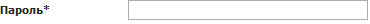
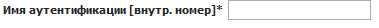
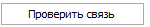
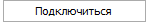

Вкладка **IP-телефония** содержит настройки для подключения телефонии.

::: info Примечание

Для работы модуля **IP-телефонии** необходимо подключение дополнительной услуги. По вопросам подключения необходимо обратиться к менеджерам компании "Tradesoft".

:::

 **Сервер/Домен**

Позволяет указать IP-адрес сервера или домен для установки соединения с IP-телефонией.

 **Кодеки**

Опция позволяет выбрать один или несколько алгоритмов кодирования аудиосигнала:

- **Выбрать все** – позволяет выбрать все кодеки;

- **G711U**;

- **G711A**;

- **G722**;

- **G729**.

::: info Примечание

По умолчанию выбраны все значения. При попытке подключиться к IP-телефонии с пустым значением в опции **Кодеки** выведется окно с ошибкой подключения.  

:::

 **Прокси**

Позволяет указать proxy-сервер для авторизации (при необходимости).

::: note Заметка

Поле **Прокси** не является обязательным, при нажатии на кнопку **Проверить связь,** в случае необходимости введения proxy-сервера, под текстовым полем **Прокси** выведется информация о **Потенциальном названии** proxy-сервера. При нажатии на которое осуществится автоматическая вставка данного названия в текстовое поле **Прокси.**

:::

 **Порт**

Позволяет ввести порт.

 **Имя пользователя**

Позволяет ввести имя пользователя или внутренний номер (зависит от поставщика IP-телефонии).

 **Пароль**

Позволяет ввести пароль.

 **Имя аутентификации [внутр. номер]**

Позволяет ввести внутренний номер пользователя.

 **Проверить связь**

Позволяет проверить работоспособность телефонии. После нажатия на кнопку выполняется подключение к серверу.

::: info Примечание

Если соединение не удастся выполнить, пользователю будет выведено сообщение об ошибке.

:::

 **Подключиться**

Позволяет выполнить подключение телефонии, доступна для всех пользователей.

::: info Примечание

При успешном подключении пользователю будет выведено соответствующее уведомление. Если соединение установить не удастся – пользователю будет выведена ошибка.

:::

