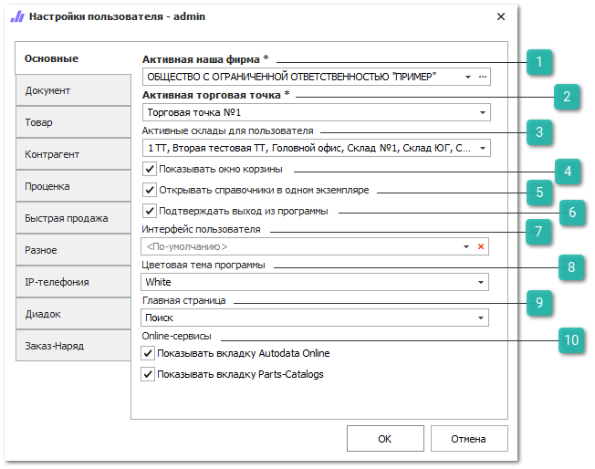
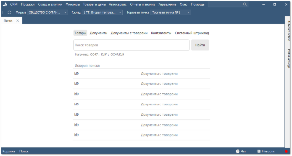

Вкладка содержит основные настройки для пользователя.

 **Активная наша фирма**

Позволяет выбрать для пользователя основную **Наша фирма** из справочника, которая будет проставляться во все документы в программе по умолчанию. За пользователем остается возможность сменить значение в документах.

 **Активная торговая точка**

Позволяет выбрать для пользователя торговую точку, которая будет проставляться в документы по умолчанию. За пользователем остается возможность изменить торговую точку в документах.

::: note Заметка

Выбор **Активной нашей фирмы** и **Активной торговой точки** доступен только среди разрешенных для пользователя:

- в настройке **Список используемых в качестве активной Торговых точек** в разделе меню **Управление ►** **Настройки программы ► Роли пользователей ► Словари ► Склады/Торговые точки**;

- в настройке **Доступные Наши фирмы** в разделе меню **Управление ►** **Настройки программы ► Роли пользователей ► Справочнике ► Контрагенты**.

:::

 **Активные склады для пользователя** 

Позволяет выбрать активные склады для пользователя из списка доступных для работы. Для неактивных складов накладываются следующие ограничения:

- недоступна проводка документов, в которых присутствуют товары с неактивного склада или указан неактивный склад в поле **Склад**;

- в **Проценке** позиции с неактивных складов выводятся с типом источника **НЕТ НА СКЛАДЕ**.

::: note Заметка

Выбор **Активных складов для пользователя** доступен только среди разрешенных для пользователя в настройке **Список складов/ТТ, доступных для работы** в разделе меню **Управление ►** **Настройки программы ► Роли пользователей ► Словари ► Склады/Торговые точки**.

:::

 **Показывать окно корзины**

Позволяет включить отображение **Корзины** в **Нижнем меню программы**.

 **Открывать справочники в одном экземпляре**

Позволяет заблокировать одновременное открытие сразу нескольких вкладок одного и того же справочника.

 **Подтверждать выход из программы**

Позволяет активировать открытие окна с необходимостью подтвердить намерение выхода из программы.

 **Интерфейс пользователя**

Позволяет при необходимости указать интерфейс рабочей области пользователя. По умолчанию пользователю доступна работа в основном окне программы. Так же есть возможность задать для пользователя альтернативный интерфейс:

- **Отметка об отгрузки товара** – при входе в программу будет открыто одно единственное окно кладовщика для установки отметки об отгрузке товара;

- **Быстра** **продажа** – при входе в программу будет открыто одно единственное окно инструмента **Быстрой продажи**.

 **Цветовая тема программы**

Позволяет настроить стиль программы. Для выбора доступны стили: **Blue**, **Dark grey** (стиль по умолчанию), **Default**, **Light**, **White**.

 **Главная страница**

Позволяет настроить начальную страницу программы, которая отображается для пользователя при входе в программу. Для выбора доступны разделы:

- **Заказы клиентов**;

- **Планировщик постов**;

- **Быстрая продажа**;

- **Дашборд**. По умолчанию установлена для всех пользователей.

- **Поиск**. Если пользователь выберет это значение, то при нажатии на кнопку **Поиск** нижнего меню программы откроется отдельная страница поиска.

- **Не выбрано**. При значении **Не выбрано** пользователю будет отображаться последняя открытая вкладка или пустая страница, если перед выходом из программы все вкладки были закрыты.

::: info Примечание

Если для пользователей настроен запрет к странице **Дашборд** в разделе  **Управление ► Настройки программы**, вкладка **Роли пользователей ► Разрешения для роли пользователей ► Отчеты ► Дашборд**, настройка **Дашборд доступен**, то рекомендуется выбрать любую другую начальную страницу, которая будет отображается при входе в программу.

:::

 **Online-сервисы**

Позволяет активировать отображение на панели вкладок:  **Autodata Online**, **Parts Catalogs**.

::: info Примечание

Поля с пометкой "\*" являются обязательными к заполнению.

:::

