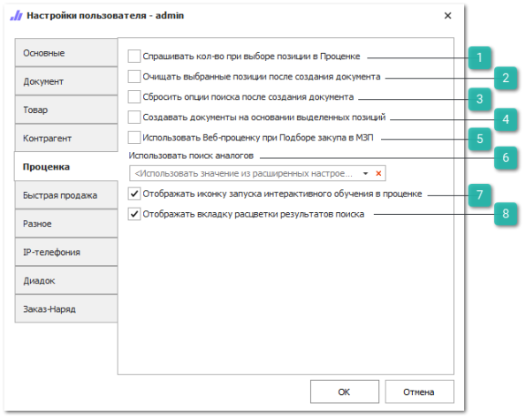

Вкладка содержит настройки для инструмента **Проценка**.

 **Спрашивать кол-во при выборе позиции в Проценке**

Регулирует появление диалога с запросом количества при выборе товаров из результатов поиска. По умолчанию добавляется 1 шт..

 **Очищать выбранные позиции после создания документов**

Позволяет активировать очищение списка выбранных позиций после создания документов на основании списка **Выбранных позиций** в **Проценке**. Опция дублирует аналогичную опцию в самом инструменте проценки, а именно в контекстном меню команды **Создать**.

 **Сбросить опции поиска после создания документа**

При активной опции, после создания документа из **Проценки**, настройки поиска в **Проценке** возвращаются к исходному состоянию (как были при открытии вкладки **Проценка**).

 **Создавать документы на основании выделенных позиций**

При активной опции, команда создания документов работает только для выделенных **Выбранных позиций** **Проценки**. Опция дублирует аналогичную в самой **Проценке**, в контекстном меню команды **Создать**.

 **Использовать Веб-проценку при подборе закупа в МЗП**

Активирует проценку в веб-прайс-листах при подборе предложений в **Мастере создания Заказа поставщику**.

 **Использовать поиск аналогов**

Позволяет определить источник поиска аналогов, при активации источника поиска в проценке "в аналогах". Значение настройки **Использовать поиск аналогов** перекрывает значение одноименной настройки в разделе меню **Управление ► Настройки программы ► Настройки** раздел **Проценка ► Аналоги**. Доступные значения:

- **в справочнике "Аналогов**" – поиск осуществляется по данным справочника;

- **в сервисе "Турбо-аналоги**" – поиск производится в базе сервиса **Турбо-аналоги**.

 **Отображать иконку интерактивного обучения в проценке**

Позволяет установить наличие интерактивного обучения по работе с **Проценкой**, которое доступно по нажатию на кнопку . 

Интерактивное обучение позволяет последовательно рассмотреть работу инструмента **Проценка**. В ходе обучения в пустом интерфейсе поочередно подсвечиваются основные блоки, рядом выводится текст с кратким описанием назначения блока. При этом неактивные блоки затемняются. В конце **Интерактивного обучения** рассматривается работа **Проценки** на примере. Рядом с каждым подсвеченным блоком отображается текстовое окно с подсказкой. На последнем шаге обучения пользователю выводится окно со ссылкой на видео по работе в **Проценке**, по загрузке различных прайс-листов и настройке цен для этих прайс-листов.

 **Отображать вкладку расцветки результатов поиска**

Позволяет установить наличие вкладки **Расцветка результатов поиска** в окне **Проценка.** 

::: note Заметка

При отключении у пользователя вкладки **Расцветка результатов поиска** параметры установленные в настройках пользователя сохраняются и будут применены к результатам поиска.

:::

