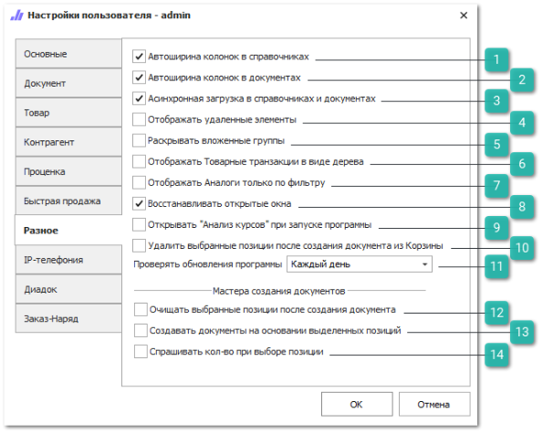

Вкладка содержит настройки для различных инструментов в программе.

 **Автоширина колонок в справочниках**

Позволяет активировать механизм автоматического подбора ширины колонок в справочниках в зависимости от содержимого.

 **Автоширина колонок в документах**

Позволяет активировать механизм автоматического подбора ширины колонок в документах в зависимости от содержимого.

 **Асинхронная загрузка в справочниках и документах**

Позволяет активировать асинхронную загрузку данных во всех журналах и справочниках: **Товары**, **Клиенты**, **Производители**. При асинхронной загрузке данные на страницах загружаются порционно, по ходу проматывания страницы.

 **Отображать удаленные элементы**

Позволяет отображать в таблицах удаленные элементы серым цветом и перечеркнутыми. При необходимости их можно восстановить нажатием кнопки **Восстановить**.

::: info Примечание

Некоторые справочники и журналы используют особый способ отображения данных для оптимизации загрузки памяти (порционное чтение). В таких ситуациях удаленные позиции отображаются только в момент удаления, до следующего обновления списка (клавиша F5).

Чтобы удаленные записи отображались необходимо отключить настройку **Асинхронная загрузка в справочниках и документах**.

:::

 **Раскрывать вложенные группы**

Позволяет отображать раскрытым дерево списков с вложенными группами.

 **Отображать товарные транзакции в виде дерева**

Позволяет включить отображение записей в журнале **Товарные транзакции** в виде древовидной структуры. Транзакции будут сворачиваться в одну строку родительской транзакции (например, транзакция *расход* свернута внутри транзакции *приход)*.

 **Отображать Аналоги только по фильтру**

Позволяет включить формирование списка аналогов в одноименном справочнике только при заданном фильтре, если фильтр пустой – список аналогов не формируется (актуально для справочников с количеством наименований более миллиона позиций). Если опция выключена, при пустом фильтре отображается все содержимое справочника.

 **Восстанавливать открытые окна**

Позволяет активировать при запуске программы восстановление окон, которые были открыты в момент предыдущего выхода из программы. При этом так же восстанавливаются блокировки редактируемых объектов. Если при восстановлении вкладки ее невозможно открыть (она уже кем-либо заблокирована), то вкладка не восстанавливается. Просмотреть список заблокированных объектов можно в журнале **Блокировок**.

::: info Примечание

При запуске программы не восстанавливаются окно **Проценка** и **Быстрая продажа**.

:::

 **Открывать "Анализ курсов" при запуске программы**

Позволяет включить автоматический запуск **Анализа курсов** валют при входе в программу.

 **Удалить выбранные позиции после создания документа из Корзины**

Позволяет активировать очищение списка позиций в **Корзине** после создания документа.

 **Проверять обновления** 

Позволяет задать периодичность проверки наличия новых обновлений программы: **Каждый день**, **Каждую неделю**, **Каждый месяц**.

::: note Заметка

При наличии новых обновлений выводится диалоговое окно, содержащее информацию о новой версии программы **Parts.Intellect**, список изменений в новой версии, а также возможность перехода на сайт Tradesoft для загрузки дистрибутива.

:::

Блок **Мастера создания документов** содержит настройки для мастеров:

 **Очищать выбранные позиции после создания документа**

Позволяет активировать очищение выбранных позиций мастера, после создания документов в мастере на их основе. Опция дублирует аналогичную опцию в самих мастерах, а именно в контекстном меню команды **Создать**.

 **Создавать документы на основании выделенных позиций**

Опция дублирует аналогичную опцию в самих мастерах, а именно в контекстном меню команды **Создать**.

::: info Примечание

Команда создания документов работает не для всего списка выбранных позиций мастера, а только для выделенных. 

:::

 **Спрашивать количество при выборе позиции**

Позволяет активировать выведение диалогового окна для ввода количества при выборе позиции в **Мастере перемещения**.

