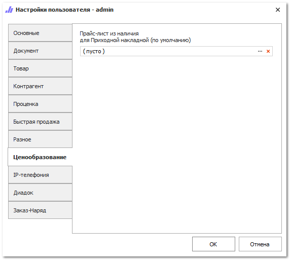
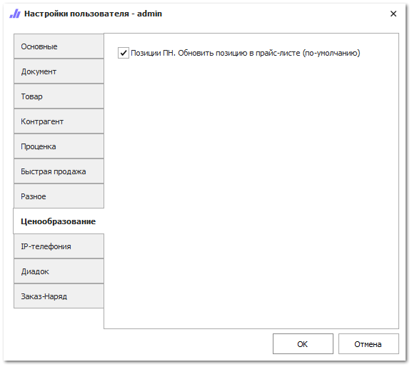

Вкладка содержит настройки для ценообразования на товары в программе. 

В зависимости от схемы ценообразования, настройки в данном разделе отличаются.

Данная вкладка доступна для следующих схем ценообразования для товаров в наличии:

- Для **Гибкой схемы** доступна настройка **Прайс-лист из наличия для Приходной накладной (по умолчанию)**, в которой можно указать прайс-лист из наличия по умолчанию, который будет автоматически подставляться при создании документа **Приходная накладная**.

- Для **Расширенной схемы** доступна настройка **Позиции ПН. Обновить позицию в прайс-листе (по умолчанию)**, которая устанавливает значение по умолчанию для свойства **Обновлять прайс-лист из наличия** в позициях документа **Приходная накладная**.

::: info Примечание

Для **Расширенной схемы** настройка доступна в случае, если в меню **Управление ►** **Настройки программы ► Настройки ► Товары и цены ► Прайс-листы и ценообразование** выключена настройка **Использовать средневзвешенную цену закупа**.

:::

